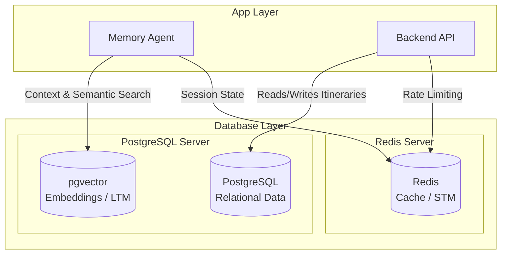

# AI Travel Assistant: Database Architecture Documentation

## 1. Introduction
Welcome to the official database architecture documentation for the **AI Travel Assistant**. This repository contains the complete specification, design, and implementation guide for the persistence and memory layer of the application. The system leverages a modern stack consisting of PostgreSQL (relational data), pgvector (vector embeddings), and Redis (caching and short-term memory).

## 2. Purpose
The purpose of this documentation suite is to provide a single source of truth for the database engineering team. It ensures that all data models, memory systems, performance tuning, and deployment strategies are standardized, highly available, and scalable from local development to production.

## 3. Problem Statement
AI applications require complex memory management to maintain conversational context while persisting long-term user preferences and relational domain data (like flights, hotels, and itineraries). A standard relational database is insufficient for semantic search, and an isolated vector database lacks transactional integrity. The challenge is to design a unified, performant hybrid database architecture that seamlessly handles relational queries, fast in-memory key-value operations, and high-dimensional vector similarity searches.

## 4. Internal Working
The database layer functions as a tripartite system:
- **PostgreSQL (Neon Cloud)**: Serves as the primary source of truth for all structured transactional data (users, bookings, itineraries).
- **pgvector (PostgreSQL Extension)**: Co-located with the primary relational data, handling embedding storage and semantic similarity search for Long-Term Memory (LTM).
- **Redis (Upstash/Docker)**: Operates as an ultra-fast, in-memory datastore for Short-Term Memory (STM), rate limiting, and session caching.

## 5. Architecture
Below is the high-level Database Architecture illustrating the interaction between the persistence layers.



## 6. Data Flow
1. **User Interaction**: User sends a prompt via the frontend.
2. **Short-Term Memory Lookup**: The Memory Agent queries Redis for immediate conversation context.
3. **Long-Term Memory Retrieval**: The prompt is embedded and queried against `pgvector` for past preferences and semantic matches.
4. **Relational Querying**: The Backend API queries PostgreSQL for concrete facts (e.g., booked flights).
5. **Persistence**: New conversational facts are embedded and saved to `pgvector`. Session updates are saved to Redis.

## 7. Diagrams (Mermaid)
*(Note: Each detailed document in this suite contains specific Mermaid diagrams pertaining to its topic, including ER diagrams, deployment topologies, and internal flowcharts).*

## 8. Best Practices
- **Naming Conventions**: Strictly enforce `snake_case` for all databases, schemas, tables, columns, and constraints.
- **Single Source of Truth**: Keep embeddings and metadata in the same PostgreSQL database to guarantee ACID compliance.
- **Connection Pooling**: Always use a connection pooler (like PgBouncer via Neon) to prevent connection exhaustion.
- **Idempotency**: Ensure all database migration scripts are idempotent.

## 9. Common Mistakes
- Relying on Redis for persistent, critical data without a backup strategy.
- Forgetting to create HNSW or IVFFlat indexes on pgvector columns, leading to full table scans.
- Querying unindexed relational columns in large tables (e.g., filtering logs by timestamp without a B-tree index).
- Using uppercase characters in PostgreSQL identifiers, forcing the use of double quotes everywhere.

## 10. Production Recommendations
- Deploy PostgreSQL on **Neon** for serverless autoscaling and branching capabilities.
- Deploy Redis on **Upstash** or a managed cloud provider for high availability.
- Implement strict Role-Based Access Control (RBAC) at the database level.
- Monitor `pg_stat_statements` for query performance continuously.

## 11. Step-by-Step Implementation
The implementation of the database layer is broken down into the following ordered phases:
1. Local Development Setup (Docker)
2. Schema Migration & Baseline (PostgreSQL)
3. Embedding Configuration (pgvector)
4. Memory Agent Integration (Redis + pgvector)
5. Cloud Deployment (Neon + Upstash)
6. Observability & Monitoring Setup

## 12. Document Index
Below is the cross-linked index of the documentation suite. As new documents are generated, this index is updated.

- [01 - Project Overview](docs/01_Project_Overview.md)
- [02 - Database Architecture](docs/02_Database_Architecture.md)
- [03 - PostgreSQL Architecture](docs/03_PostgreSQL.md)
- [04 - pgvector: Semantic Memory](docs/04_pgvector.md)
- [05 - Neon Serverless PostgreSQL](docs/05_Neon_PostgreSQL.md)
- [06 - Redis: High-Performance Memory](docs/06_Redis.md)
- [07 - Docker Database Infrastructure](docs/07_Docker_Database.md)
- [08 - Database Schema](docs/08_Database_Schema.md)
- [09 - Entity Relationship Diagram](docs/09_ER_Diagram.md)
- *10_SQL_Guide.md (Pending)*
- *11_Embeddings.md (Pending)*
- *12_Memory_System.md (Pending)*
- *13_Memory_Agent.md (Pending)*
- *14_Retrieval_Pipeline.md (Pending)*
- *15_RAG_Pipeline.md (Pending)*
- *16_Deployment.md (Pending)*
- *17_Backup_and_Recovery.md (Pending)*
- *18_Performance_Optimization.md (Pending)*
- *19_Monitoring.md (Pending)*
- *20_Development_Setup.md (Pending)*
- *21_Terminal_Commands.md (Pending)*

## 13. SQL Examples
```sql
-- Example: Standard table creation adhering to naming conventions
CREATE TABLE user_profiles (
    user_id UUID PRIMARY KEY DEFAULT gen_random_uuid(),
    email VARCHAR(255) UNIQUE NOT NULL,
    created_at TIMESTAMP WITH TIME ZONE DEFAULT CURRENT_TIMESTAMP
);
```

## 14. Terminal Commands
```bash
# Start local database stack
docker-compose up -d

# View database logs
docker-compose logs -f postgres

# Access Redis CLI
docker exec -it ai-travel-redis redis-cli
```

## 15. Deployment Considerations
- Use environment variables for all database connection strings.
- Separate development, staging, and production databases entirely.
- Utilize Neon's database branching for zero-copy staging environments.

## 16. Security Considerations
- Encrypt data at rest and in transit (SSL/TLS enforced).
- Never expose database ports directly to the public internet (use VPCs or IP whitelisting).
- Use least-privilege principles for application database users (e.g., no schema alteration rights for the runtime API).

## 17. Performance Optimization
- Index high-cardinality columns utilized in `WHERE` clauses.
- Tune `work_mem` and `shared_buffers` based on the production instance size.
- Utilize approximate nearest neighbor (ANN) indexes for pgvector to ensure low-latency similarity searches.

## 18. References
- [PostgreSQL Official Documentation](https://www.postgresql.org/docs/)
- [pgvector GitHub Repository](https://github.com/pgvector/pgvector)
- [Redis Official Documentation](https://redis.io/docs/)
- [Neon Serverless Postgres](https://neon.tech/)
