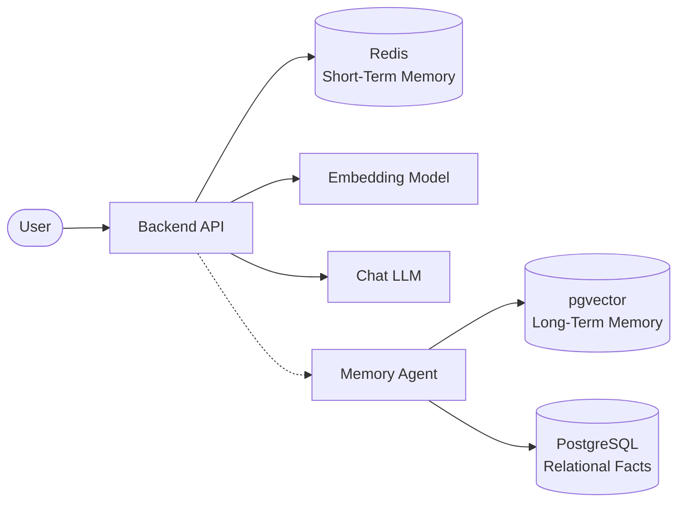

# AI Travel Assistant


## Project Overview
The **AI Travel Assistant** is an intelligent, context-aware digital travel agent. Unlike standard chatbots that suffer from amnesia, this system utilizes a cutting-edge **Memory System** backed by PostgreSQL, `pgvector`, and Redis. It remembers your dietary restrictions from two years ago, recalls your budget from five minutes ago, and dynamically generates personalized travel itineraries.

## Features
- **Long-Term Memory:** Uses semantic vector embeddings (`pgvector`) to permanently remember user preferences.
- **Short-Term Memory:** Uses in-memory caching (Redis) to maintain lightning-fast conversational context.
- **Retrieval-Augmented Generation (RAG):** Eliminates AI hallucinations by grounding every LLM response in rigid facts from the database.
- **Serverless Infrastructure:** Built for infinite scale using Neon (PostgreSQL) and Upstash (Redis).

## Technology Stack
- **Database:** PostgreSQL (Neon Serverless)
- **Vector Engine:** pgvector
- **Cache/Session State:** Redis (Upstash)
- **Backend:** Python (FastAPI)
- **AI Models:** OpenAI GPT-4o & text-embedding-3
- **Local Dev:** Docker & Docker Compose

## Architecture Diagram

*(For the complete, detailed data flow, see [22 - Master Architecture](docs/22_ARCHITECTURE.md))*

## Getting Started
To spin up the local database infrastructure and begin development, ensure you have Docker installed and run:

```bash
git clone https://github.com/mrtej117/Sahayatri.git
cd Sahayatri
cp .env.example .env
docker-compose up -d
```
For a comprehensive setup guide, read [20 - Development Setup](docs/20_Development_Setup.md).

## Documentation Index
This repository contains a massive, production-grade documentation suite designed to take developers from beginner concepts to advanced database engineering. 

| # | Topic | Description |
|---|---|---|
| **01** | [Project Overview](docs/01_Project_Overview.md) | High-level goals and the AI amnesia problem. |
| **02** | [Database Architecture](docs/02_Database_Architecture.md) | Introduction to the Redis + Postgres hybrid design. |
| **03** | [PostgreSQL Architecture](docs/03_PostgreSQL.md) | Deep dive into relational database concepts. |
| **04** | [pgvector: Semantic Memory](docs/04_pgvector.md) | How vector databases understand meaning. |
| **05** | [Neon PostgreSQL](docs/05_Neon_PostgreSQL.md) | Serverless compute and storage separation. |
| **06** | [Redis](docs/06_Redis.md) | Utilizing RAM for transient short-term memory. |
| **07** | [Docker Database Infrastructure](docs/07_Docker_Database.md) | Containerizing the database for local dev. |
| **08** | [Database Schema](docs/08_Database_Schema.md) | Table structures, JSONB, and UUIDs. |
| **09** | [Entity Relationship Diagram](docs/09_ER_Diagram.md) | Visual mapping of database table relationships. |
| **10** | [SQL Guide](docs/10_SQL_Guide.md) | Crucial queries for building and querying the DB. |
| **11** | [Embeddings](docs/11_Embeddings.md) | Mathematical representation of language. |
| **12** | [Memory System](docs/12_Memory_System.md) | Episodic vs Semantic memory lifecycles. |
| **13** | [Memory Agent](docs/13_Memory_Agent.md) | The background worker that consolidates memories. |
| **14** | [Retrieval Pipeline](docs/14_Retrieval_Pipeline.md) | Fetching vectors and relational data. |
| **15** | [RAG Pipeline](docs/15_RAG_Pipeline.md) | End-to-End Retrieval-Augmented Generation flow. |
| **16** | [Deployment](docs/16_Deployment.md) | Moving from local Docker to Neon and Upstash. |
| **17** | [Backup and Recovery](docs/17_Backup_and_Recovery.md) | Point-in-time recovery and disaster protocols. |
| **18** | [Performance Optimization](docs/18_Performance_Optimization.md) | HNSW indexing, B-Trees, and EXPLAIN ANALYZE. |
| **19** | [Monitoring](docs/19_Monitoring.md) | Datadog, pg_stat_statements, and alerts. |
| **20** | [Development Setup](docs/20_Development_Setup.md) | Step-by-step guide to installing the project. |
| **21** | [Terminal Commands](docs/21_Terminal_Commands.md) | Cheat sheet for Git, Docker, and PostgreSQL. |
| **22** | [Master Architecture](docs/22_ARCHITECTURE.md) | The definitive end-to-end blueprint. |
| **23** | [Project Folder Structure](docs/23_Project_Folder_Structure.md) | Codebase navigation and MVC logic. |
| **24** | [Technology Decisions](docs/24_Technology_Decisions.md) | Why we chose Postgres over MongoDB, Neon over RDS, etc. |

## Folder Structure
```text
Sahayatri/
├── docs/                 # Extensive Architecture Documentation
├── backend/              # FastAPI Application (API, DB Models, Agent)
├── frontend/             # User Interface (React/Next.js)
├── docker-compose.yml    # Local Infrastructure Orchestration
└── README.md             # You are here
```

## Contributing
We welcome contributions! Please read our [Contributing Guide](CONTRIBUTING.md) to understand our Git branching strategy, pull request rules, and coding standards.

## Roadmap
- [x] Design Database Architecture
- [x] Implement pgvector for Long-Term Memory
- [x] Implement Redis for Short-Term Memory
- [ ] Connect FastAPI Backend
- [ ] Build Frontend UI
- [ ] Deploy to Production

## License
This project is licensed under the MIT License - see the [LICENSE](LICENSE) file for details.
