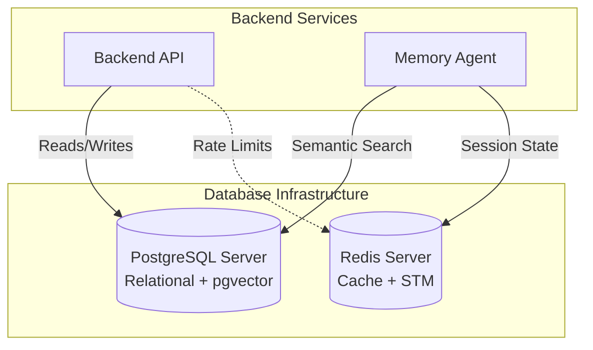
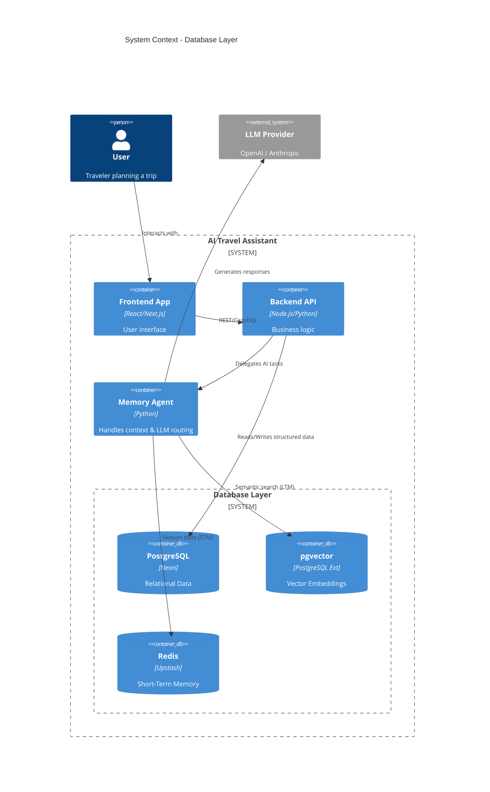

# 01 - Project Overview: AI Travel Assistant Database

## 1. Introduction
The **AI Travel Assistant** is a state-of-the-art intelligent application designed to help users plan, book, and manage their travel itineraries. At the core of this system lies a sophisticated hybrid database architecture. This document provides a high-level overview of the database layer, outlining its components, responsibilities, and the underlying rationale behind its design.

## 2. Purpose
The purpose of the database architecture is to provide robust, scalable, and highly available persistence for the AI Travel Assistant. It must seamlessly support three distinct workloads:
1. **Transactional Workloads (OLTP):** Managing user accounts, bookings, and structured itinerary data.
2. **Semantic Search:** Storing and retrieving high-dimensional embeddings representing user preferences and travel contexts.
3. **High-Speed Caching & Context:** Managing ephemeral conversational state and mitigating API rate limits.

## 3. Problem Statement
Traditional travel applications rely solely on relational databases, which excel at structured data but fail at semantic search (e.g., "Find me a quiet, romantic hotel near the beach"). Conversely, standalone vector databases lack ACID compliance and foreign key constraints necessary for financial transactions (e.g., booking a hotel). The problem is to bridge these gaps without creating a fragmented, hard-to-maintain infrastructure.

## 4. Internal Working
To solve the problem statement, the system is engineered around a unified approach:
- **PostgreSQL** handles the relational, transactional requirements with strict schema enforcement, constraints, and ACID guarantees.
- **pgvector** is installed directly within PostgreSQL, allowing vector embeddings (Long-Term Memory) to exist alongside structured data. This enables complex hybrid queries (e.g., `SELECT * FROM hotels WHERE price < 200 ORDER BY embedding <-> '[user_preference_vector]' LIMIT 5`).
- **Redis** operates outside the relational layer to serve as an in-memory Key-Value store, holding conversational Short-Term Memory (STM) and drastically reducing database load for frequently accessed, ephemeral data.

## 5. Architecture
The architecture unifies structured and unstructured persistence, accessed by different application subsystems.



## 6. Data Flow
1. **Ingestion**: The Backend API writes raw user and booking data to PostgreSQL.
2. **Analysis & Embedding**: The Memory Agent processes user interactions, generates vector embeddings, and stores them in the `pgvector` tables inside PostgreSQL.
3. **Conversational Loop**: During a chat session, the Memory Agent reads and writes immediate context to Redis (STM).
4. **Context Enrichment**: When generating a response, the Memory Agent queries `pgvector` for long-term preferences and joins it with relational data (e.g., matching a preferred vibe with actual available flights/hotels).

## 7. Diagrams (Mermaid)
*System Context Diagram (Database Focus)*



## 8. Best Practices
- **Infrastructure as Code (IaC):** All database provisioning should be managed via Terraform or similar tools.
- **Migration Versioning:** Use robust migration tools (e.g., Flyway, Prisma, Alembic) to version control all schema changes.
- **Separation of Concerns:** Keep complex business logic out of database triggers; handle it in the Backend API or Memory Agent.

## 9. Common Mistakes
- **Over-caching:** Trying to put everything in Redis, leading to memory eviction issues and out-of-sync data.
- **Ignoring Constraints:** Failing to define `FOREIGN KEY` constraints, assuming the application layer will perfectly handle data integrity.
- **Unbounded Vectors:** Storing massive, unnormalized embeddings that blow up the database size without adding semantic value.

## 10. Production Recommendations
- Use a managed PostgreSQL service (like **Neon**) for built-in point-in-time recovery (PITR) and scaling.
- Utilize highly available Redis clusters (like **Upstash**) with eviction policies tailored to session lifespans.
- Enforce strict timeouts on database queries to prevent rogue analytical queries from impacting transactional performance.

## 11. Step-by-Step Implementation
1. Define the core entity relationship model (Users, Trips, Bookings).
2. Define the schema for the AI memory (User Profiles, Preferences, Interaction Logs).
3. Initialize the Docker environment for local development.
4. Write SQL migrations for the baseline schema.
5. Setup database users and role-based access control.

## 12. Folder Structure
The physical layout of the database project repository (relative to the application):

```text
/db
├── /migrations         # Versioned SQL migration files (e.g., V1__init.sql)
├── /seeds              # Seed data for development and testing
├── /scripts            # Database maintenance and backup scripts
├── /docker             # Docker Compose configurations
└── /docs               # This documentation suite
```

## 13. SQL Examples
```sql
-- Initializing the vector extension
CREATE EXTENSION IF NOT EXISTS vector;

-- Example hybrid table combining relational and vector data
CREATE TABLE travel_destinations (
    destination_id SERIAL PRIMARY KEY,
    name VARCHAR(100) NOT NULL,
    country VARCHAR(100) NOT NULL,
    description TEXT,
    embedding VECTOR(1536) -- OpenAI embedding dimension
);
```

## 14. Terminal Commands
```bash
# Check if PostgreSQL is running locally
docker ps | grep postgres

# Run database migrations (example using a generic CLI)
db-migrate up

# Create a logical backup
pg_dump -U postgres -h localhost -d ai_travel > backup.sql
```

## 15. Deployment Considerations
- **Neon** separates storage and compute. This allows for branching the database instantly for feature testing without duplicating data physically.
- Ensure the Redis instance is deployed in the same region (or VPC) as the application servers to minimize latency for STM retrievals.

## 16. Security Considerations
- Use specialized database roles: one for migrations (DDL privileges) and one for the application runtime (DML privileges only).
- Encrypt PII (Personally Identifiable Information) such as passport numbers or payment tokens at the application layer before storing them in PostgreSQL.

## 17. Performance Optimization
- Pre-warm the PostgreSQL cache for frequently accessed lookup tables (e.g., Airport codes).
- Utilize Redis pipelines to batch multiple STM read/write operations into a single network round-trip.

## 18. References
- [C4 Model for Software Architecture](https://c4model.com/)
- [PostgreSQL Architecture Fundamentals](https://www.postgresql.org/docs/current/architecture.html)
- [Vector Databases in AI](https://en.wikipedia.org/wiki/Vector_database)
