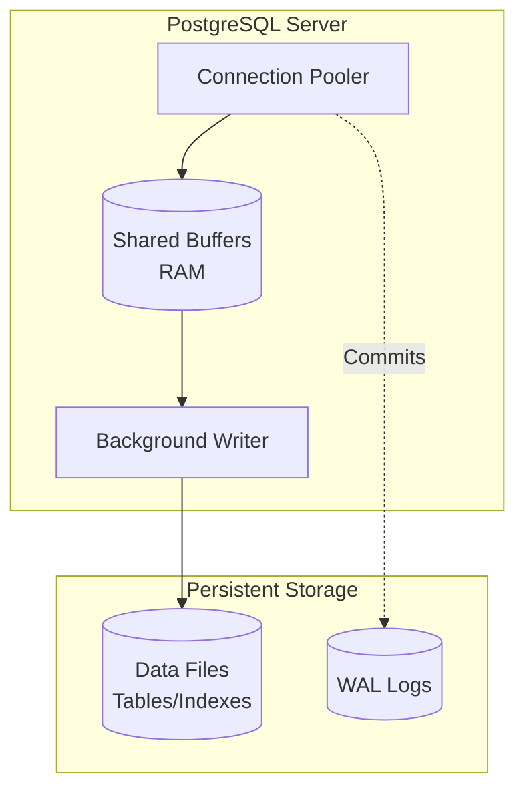
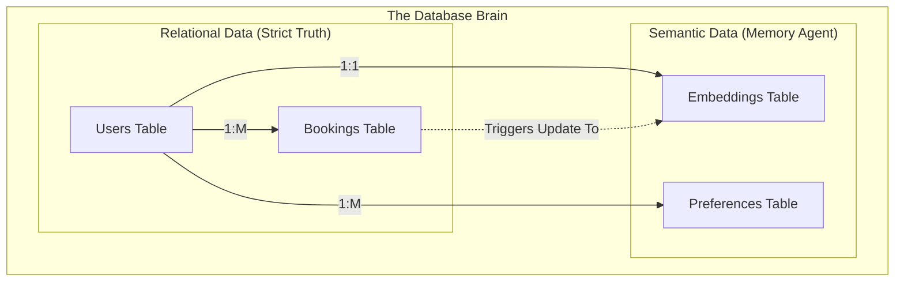

# 03 - PostgreSQL Internal Architecture

## 1. Introduction
PostgreSQL acts as the foundational layer and the "Source of Truth" for the AI Travel Assistant. While other systems handle ephemeral caching (Redis) or vector embeddings (`pgvector`), vanilla PostgreSQL stores the concrete, relational facts of the system: user accounts, bookings, flight schedules, and hotel inventories. It is the logical core that the "brain" of the database relies upon before applying semantic AI features.

## 2. Purpose
The purpose of PostgreSQL in this architecture is to provide strict ACID (Atomicity, Consistency, Isolation, Durability) guarantees. When a user books a flight or updates their profile, this transaction must not be lost, duplicated, or corrupted. It also acts as the host environment for `pgvector`, ensuring that relational data and semantic data live in the exact same physical storage.

## 3. Problem Statement
Generative AI applications often suffer from "hallucinations" because they rely on isolated vector databases that get out-of-sync with the real-world transactional database. If a user cancels a booking, but the separate vector database still has it embedded as an active trip, the AI will confidently give the user wrong information. The problem is keeping AI memory strictly synchronized with real-world business logic.

## 4. Internal Working
By using PostgreSQL as the primary data store, we solve the synchronization problem. 
- **The Brain of the Database**: The Memory Agent relies on PostgreSQL to verify facts. When the Memory Agent retrieves semantic matches (e.g., "past romantic trips"), it immediately performs a `JOIN` with the strict relational tables (e.g., `WHERE booking_status = 'confirmed'`). 
- **WAL (Write-Ahead Logging)**: Ensures that every change to a user's itinerary is written to disk sequentially before the transaction is marked as committed, ensuring zero data loss.

## 5. Architecture
Below is the internal architecture of the PostgreSQL deployment, demonstrating how it processes the structured data that feeds the Memory Agent.



## 6. Data Flow
1. **Query Arrival**: The Backend API or Memory Agent sends a `SELECT` or `INSERT` query.
2. **Parsing & Planning**: The Postgres Query Planner decides the fastest way to fetch the data (e.g., using a B-Tree index on `user_id`).
3. **Shared Buffers (Memory)**: Postgres checks if the requested data block is already in RAM. If yes, it returns it instantly.
4. **Disk Fetch**: If not in RAM, it fetches the page from the Data Files on disk.
5. **Commit**: For writes, the change is recorded in the WAL (Write-Ahead Log) to guarantee durability before updating the actual data files.

## 7. Diagrams (Mermaid)
*Logical Interaction between Relational Truth and AI Memory*



## 8. Best Practices
- **Foreign Keys**: Always define foreign keys (e.g., `user_id` in `bookings` references `id` in `users`). This prevents the AI from querying orphaned records.
- **UUIDs for Primary Keys**: Use `UUIDv4` or `UUIDv7` instead of sequential integers to prevent ID-guessing attacks and allow distributed ID generation by the Backend API.
- **Timestamps**: Every table must have `created_at` and `updated_at` columns with `TIMESTAMP WITH TIME ZONE`.

## 9. Common Mistakes
- **No Connection Pooler**: Direct connections from a serverless Backend API (like AWS Lambda or Vercel) will crash PostgreSQL immediately due to connection exhaustion.
- **SELECT ***: Fetching all columns, especially when one of the columns contains massive `pgvector` embeddings, wasting massive amounts of network bandwidth and memory.
- **Missing Indexes**: Failing to create B-Tree indexes on foreign keys, causing full table scans during `JOIN` operations.

## 10. Production Recommendations (Deployment)
- **Which is good for this database?** We strongly recommend **Neon Serverless Postgres** for this architecture. 
  - *Why?* Neon separates storage from compute. It can scale compute resources instantly during high travel booking seasons and scale down to zero to save costs. It also natively supports `pgvector`.
- Alternative: **AWS RDS for PostgreSQL** if your infrastructure is strictly bound to AWS and you require predictable, non-serverless billing.

## 11. Step-by-Step Implementation
1. Provision the Neon PostgreSQL cluster.
2. Create the core relational schemas (Users, Itineraries, Bookings).
3. Establish B-Tree indexes on all foreign keys and frequently searched columns (like email, dates).
4. Integrate an ORM (e.g., Prisma, Drizzle, or SQLAlchemy) in the source code to manage migrations.

## 12. Folder Structure
Database-specific source code organization:

```text
/db
├── /schemas
│   ├── users.sql
│   ├── bookings.sql
│   └── itineraries.sql
├── /triggers
│   └── update_timestamps.sql
└── /indexes
    └── core_indexes.sql
```

## 13. SQL Examples
```sql
-- Creating the foundational Users table
CREATE TABLE users (
    id UUID PRIMARY KEY DEFAULT gen_random_uuid(),
    email VARCHAR(255) UNIQUE NOT NULL,
    full_name VARCHAR(100) NOT NULL,
    created_at TIMESTAMP WITH TIME ZONE DEFAULT CURRENT_TIMESTAMP,
    updated_at TIMESTAMP WITH TIME ZONE DEFAULT CURRENT_TIMESTAMP
);

-- Creating a B-Tree Index for fast lookups
CREATE INDEX idx_users_email ON users(email);
```

## 14. Terminal Commands
```bash
# Connect to PostgreSQL locally via Docker
docker exec -it ai-travel-postgres psql -U postgres -d ai_travel

# View table schema inside psql
\d users
```

## 15. Deployment Considerations
- **Automated Backups**: Neon handles this automatically (Point-in-Time Recovery). If self-hosting, configure `pgBackRest` or `WAL-G` for continuous archiving.
- **Database Migrations**: Run migrations during deployment pipelines (CI/CD) using tools like Flyway or Liquibase before the new Backend API code is deployed.

## 16. Security Considerations
- Enable Row-Level Security (RLS) if multi-tenancy is required (e.g., if travel agencies use the platform to manage multiple clients).
- Mask or encrypt sensitive data like `passport_number` using pgcrypto or at the application layer.

## 17. Performance Optimization
- Run `VACUUM ANALYZE` regularly to update statistics for the query planner.
- Tune `shared_buffers` to 25% of total system RAM.
- Tune `effective_cache_size` to 50%-75% of total system RAM to help the query planner make intelligent decisions.

## 18. References
- [PostgreSQL Core Architecture](https://www.postgresql.org/docs/current/overview.html)
- [Neon Serverless Architecture](https://neon.tech/docs/architecture/architecture-overview)
- [PostgreSQL UUIDs](https://www.postgresql.org/docs/current/datatype-uuid.html)
