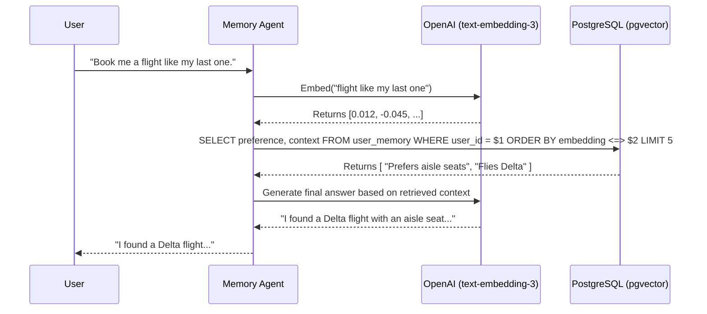

# 04 - pgvector: Long-Term Semantic Memory

## 1. Introduction
`pgvector` is an open-source extension for PostgreSQL that enables vector similarity search. In the AI Travel Assistant architecture, it functions as the **Semantic Brain of the Database**. While vanilla PostgreSQL stores structured facts, `pgvector` stores high-dimensional embeddings (mathematical representations of meaning). This enables the Memory Agent to query the database conceptually rather than exactly.

## 2. Purpose
The purpose of `pgvector` is to provide **Long-Term Memory (LTM)** for the AI Agent. When a user states, "I loved that quiet, secluded beach in Bali last year," the exact wording might never be used again. By converting this preference into a vector embedding and storing it via `pgvector`, the AI can retrieve this preference months later when the user asks, "Find me a hotel with a similar vibe to my Bali trip."

## 3. Problem Statement
Standalone vector databases (like Pinecone, Milvus, or Qdrant) excel at semantic search but force developers to split their data infrastructure. This causes severe data synchronization issues: if a user deletes their account from the relational database, their vectors remain orphaned in the vector database unless complex event-driven cleanup pipelines are built. 

## 4. Internal Working
By placing `pgvector` directly inside PostgreSQL, the Semantic Brain lives alongside the Relational Truth. 
- **Data Co-location:** Embeddings are just another column in a standard table. 
- **Hybrid Querying:** You can perform a single SQL query that filters by exact match (e.g., `user_id`, `budget < 1000`) and orders by semantic similarity (e.g., `embedding <-> query_embedding`).
- **Memory Storage:** As the user interacts, the Memory Agent continuously summarizes conversations, converts them to vectors using an LLM embedding model (e.g., OpenAI `text-embedding-3-small`), and inserts them into PostgreSQL.

## 5. Architecture
Below is the architecture of the Long-Term Semantic Memory pipeline.


## 6. Data Flow
1. **Extraction**: The Memory Agent identifies a long-term preference from the user's chat (e.g., "User prefers aisle seats").
2. **Embedding**: The Agent calls the LLM Embedding API, which converts the text into a 1536-dimensional array of floats.
3. **Storage**: The Agent executes an `INSERT` statement into PostgreSQL, storing the text, the `user_id`, and the embedding vector.
4. **Retrieval**: On future prompts, the user's new question is embedded. PostgreSQL calculates the Cosine Distance (`<=>`) between the prompt's vector and the user's stored vectors to find the most contextually relevant memories.

## 7. Diagrams (Mermaid)
*Semantic Search Execution Pipeline*



## 8. Best Practices
- **Use HNSW Indexes**: Always use Hierarchical Navigable Small World (HNSW) indexes for `pgvector` in production. It provides vastly superior query speeds compared to exact nearest neighbor (K-NN) scans.
- **Normalize Vectors**: If you use Cosine Similarity (`<=>`), ensure your embedding provider outputs normalized vectors. OpenAI's embeddings are pre-normalized, making them highly efficient.
- **Partitioning**: If scaling to millions of users, partition the memory tables by `user_id` to keep index sizes small and queries lightning fast.

## 9. Common Mistakes
- **Building the Index Too Early**: Building an IVFFlat or HNSW index on an empty table is inefficient. Load a representative sample of data (at least 10,000 rows) *before* creating the index to allow PostgreSQL to calculate optimal clusters/graphs.
- **Storing Useless Embeddings**: Embedding every single message a user sends ("Hi", "Thanks"). Only embed summarized, meaningful preferences extracted by the Memory Agent.

## 10. Production Recommendations
- **Deployment**: Neon Serverless Postgres comes with `pgvector` pre-installed and optimized. This is highly recommended over compiling it manually on self-hosted instances.
- **Dimensions**: Ensure your `VECTOR(N)` dimension strictly matches your embedding model. For OpenAI `text-embedding-3-small`, `N = 1536`.

## 11. Step-by-Step Implementation
1. Connect to PostgreSQL and run `CREATE EXTENSION vector;`.
2. Create the `user_memories` table with a `VECTOR(1536)` column.
3. Implement the Backend function to generate embeddings via the chosen LLM provider.
4. Write the SQL `SELECT` statement utilizing the `<=>` (Cosine Distance) operator.
5. Once populated with initial test data, create the HNSW index.

## 12. Folder Structure
```text
/db
├── /migrations
│   ├── V2__add_pgvector_extension.sql
│   └── V3__create_memory_tables.sql
└── /scripts
    └── backfill_embeddings.py  # Script to embed existing relational data
```

## 13. SQL Examples
```sql
-- Enable the extension
CREATE EXTENSION IF NOT EXISTS vector;

-- Create the semantic memory store
CREATE TABLE user_memories (
    id UUID PRIMARY KEY DEFAULT gen_random_uuid(),
    user_id UUID NOT NULL REFERENCES users(id) ON DELETE CASCADE,
    memory_text TEXT NOT NULL,
    category VARCHAR(50), -- e.g., 'flight_preference', 'hotel_vibe'
    embedding VECTOR(1536),
    created_at TIMESTAMP WITH TIME ZONE DEFAULT CURRENT_TIMESTAMP
);

-- Build the HNSW index for ultra-fast semantic search
CREATE INDEX idx_user_memories_embedding 
ON user_memories USING hnsw (embedding vector_cosine_ops);

-- Hybrid Query: Exact filter + Semantic Search
SELECT memory_text 
FROM user_memories 
WHERE user_id = '123e4567-e89b-12d3-a456-426614174000'
ORDER BY embedding <=> '[0.012, -0.045, ...]' 
LIMIT 5;
```

## 14. Terminal Commands
```bash
# Verify pgvector is installed in your Neon/Docker database
psql -c "SELECT * FROM pg_extension WHERE extname = 'vector';"
```

## 15. Deployment Considerations
- Vector indexes consume significant RAM. Monitor PostgreSQL's memory usage closely. You may need to upgrade the compute instance size on Neon if the `user_memories` table exceeds several million rows.

## 16. Security Considerations
- Embeddings are irreversible mathematical hashes, but the accompanying `memory_text` is plain text. Treat `user_memories` with the highest security clearance (encryption at rest, strict RLS policies) as it contains highly personal behavioral data.

## 17. Performance Optimization
- **`m` and `ef_construction` parameters**: When creating the HNSW index, tuning `m` (max connections per layer, default 16) and `ef_construction` (dynamic list size during build, default 64) can trade slower build times for significantly faster query times.
- **Pre-filtering**: Always filter by `user_id` *before* the vector `ORDER BY` clause to limit the search space.

## 18. References
- [pgvector Official GitHub](https://github.com/pgvector/pgvector)
- [OpenAI Embeddings Documentation](https://platform.openai.com/docs/guides/embeddings)
- [Neon pgvector Guide](https://neon.tech/docs/extensions/pgvector)
