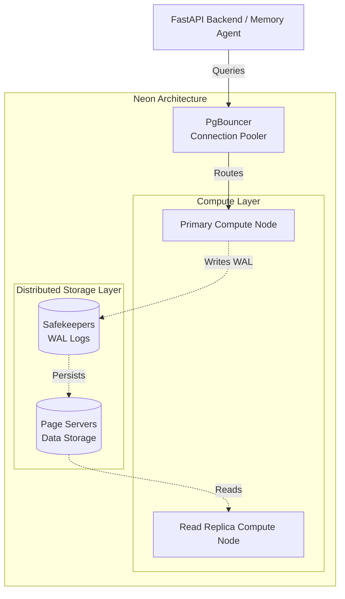

# 05 - Neon Serverless PostgreSQL

## 1. What is Neon?
Neon is a modern, open-source, serverless PostgreSQL database. It is built specifically for the cloud, separating the traditional monolithic PostgreSQL architecture into two distinct layers: **compute** (processing queries) and **storage** (saving data). Neon provides PostgreSQL exactly as you know it, but with "cloud-native" superpowers like instant branching, automatic scaling, and pay-as-you-go pricing.

## 2. Why Neon was Created
Historically, managing a PostgreSQL database in production was painful. If your application went viral, you had to manually upgrade your database server (resulting in downtime). If you wanted to test a risky database migration, you had to create a complete copy of your production database, which took hours and cost double the money. Neon was created to solve these infrastructure headaches, allowing developers to treat databases like Git repositories (branchable, fast, and scalable).

## 3. Problems Neon Solves
- **Wasted Resources:** Traditional databases run 24/7, even when no one is using your app. Neon can "scale to zero" when idle, saving money.
- **Painful Scaling:** When traffic spikes, Neon automatically scales up its compute power to handle the load without downtime.
- **Testing Risks:** Before Neon, testing migrations on production data was dangerous. Neon solves this with instant "Branching."

## 4. How Neon Differs from Installing PostgreSQL Locally
When you install PostgreSQL on your local laptop, both the CPU (compute) and the Hard Drive (storage) are tightly coupled in the same software process. If the CPU crashes, the whole database crashes. 
In Neon, the storage is a distributed system spread across many physical machines. The compute node is totally separate. If a compute node crashes, Neon instantly spins up a new one and attaches it to the existing storage network, resulting in incredible resilience.

## 5. Neon Architecture
Below is the GitHub-supported Mermaid architecture diagram demonstrating the separation of compute and storage.



## 6. Serverless PostgreSQL Explained
"Serverless" means you do not have to provision or manage servers. You simply connect to a URL. Behind the scenes, Neon automatically monitors your database traffic. If your AI Travel Assistant is flooded with users booking summer vacations, Neon instantly allocates more RAM and CPU to the compute node. When it's 3:00 AM and traffic stops, Neon pauses the compute node, meaning you aren't paying for idle time.

## 7. Storage Architecture
Neon's storage is highly specialized. It consists of two parts:
- **Safekeepers:** These servers receive the Write-Ahead Log (WAL) from the compute node. They exist purely to guarantee durability. As soon as a transaction hits a Safekeeper, it is safe from data loss.
- **Page Servers:** These servers read the WAL from the Safekeepers and construct the actual data pages (the tables and indexes). They are distributed and redundant.

## 8. Compute Architecture
The compute node is just a standard, open-source PostgreSQL engine (no proprietary vendor lock-in). However, it is modified slightly so that instead of writing to a local hard drive, it streams its operations over the network to the Safekeepers.

## 9. Branching
Just like you can create a `git branch` in your code, Neon lets you create a branch of your database. A database branch gives you an isolated, completely independent connection string containing a snapshot of your production data at that exact second. 
- *Why it's magic:* It uses "Copy-on-Write" technology. A branch of a 1TB database takes 1 second to create and uses 0 extra bytes of storage until you actually start modifying data on the branch.

## 10. Autoscaling
Neon scales in two directions:
- **Scale-Up:** Dynamically adds CPU and RAM based on load.
- **Scale-to-Zero:** After a period of inactivity (e.g., 5 minutes), the compute node shuts down. The next time a connection is made, it takes about 1-2 seconds (cold start) to wake up.

## 11. Connection Strings
A Neon connection string looks identical to a standard PostgreSQL string.
`postgresql://[user]:[password]@[endpoint_id].aws.neon.tech/ai_travel?sslmode=require`

Neon also offers a **pooled** connection string, which includes PgBouncer automatically. This is essential for serverless backend frameworks (like AWS Lambda or Vercel) to prevent connection limits from being exhausted.

## 12. Security
- **Encryption:** Data is encrypted at rest and in transit.
- **IP Allowlisting:** You can restrict database access to specific IP addresses (e.g., only your Backend API server).
- **Roles:** Neon supports standard PostgreSQL Role-Based Access Control (RBAC).

## 13. Backups
Neon completely reinvents backups. Because of its Page Server architecture, Neon stores the entire history of your database continuously. This allows for **Point-in-Time Recovery (PITR)**. If you accidentally DROP a table at 2:15 PM, you can simply restore the database to exactly 2:14:59 PM.

## 14. How pgvector works inside Neon
Neon comes with the `pgvector` extension pre-installed. Because Neon's storage is optimized for cloud reads, pulling vector embeddings into the compute node's memory is incredibly fast. When the AI Memory Agent performs a semantic search, Neon's compute node calculates the vector distances using HNSW indexes just as effectively as a dedicated vector database.

## 15. How Neon fits into our AI Travel Assistant
In our AI Travel Assistant, Neon is the absolute core of the architecture.
- It stores user profiles and travel itineraries.
- It stores the AI's Long-Term Memory (via `pgvector`).
- Because travel traffic is highly seasonal and unpredictable, Neon's autoscaling ensures the app doesn't crash when a specific flight route goes viral on social media.

## 16. Local Docker PostgreSQL vs Neon comparison
| Feature | Local Docker PostgreSQL | Neon Serverless |
| :--- | :--- | :--- |
| **Setup** | Requires `docker-compose` and local resources. | Instant via web dashboard. |
| **Scaling** | Manual hardware upgrades required. | Automatic autoscaling. |
| **Cost** | Free (uses your laptop power). | Pay-as-you-go based on compute time. |
| **Branching** | Not possible without heavy manual copying. | Instant, 1-click branching. |
| **Use Case** | Local development, offline coding. | Production, Staging, Cloud CI/CD. |

## 17. Free Plan Limitations
If you are learning or building a prototype, Neon's free tier has limitations to be aware of:
- Compute size is fixed (no autoscaling).
- Storage limit is relatively small (e.g., 500MB).
- Point-in-Time recovery history is limited (e.g., 24 hours).

## 18. Production Deployment Recommendations
- Use **VPC Peering** or **PrivateLink** if your Backend API is hosted on AWS, ensuring database traffic never traverses the public internet.
- Set a **maximum compute limit** in Neon so autoscaling doesn't result in an unexpected billing surprise during a DDoS attack.

## 19. Conceptual Connection to FastAPI
*How FastAPI connects to Neon (Conceptually):*
FastAPI (a Python backend framework) typically uses an ORM (like SQLAlchemy or SQLModel) or a driver (like `asyncpg`).
FastAPI spins up its own connection pool. It takes the Neon pooled connection string from a `.env` file, connects to the database, and executes SQL. FastAPI never knows it is talking to a "Serverless" database; to FastAPI, Neon looks and acts exactly like a normal, boring PostgreSQL server.

```mermaid
sequenceDiagram
    participant FA as FastAPI Backend
    participant Pool as Neon PgBouncer
    participant DB as Neon Compute Node
    
    FA->>Pool: "SELECT * FROM users;" (Using pooled URL)
    Pool->>DB: Forwards connection
    DB-->>FA: Returns user rows
```

## 20. Best Practices
- **Use the Pooled URL:** Always use the connection string that has `-pooler` in it for web APIs.
- **Database Migrations on Branches:** When making a schema change, create a Neon branch first, run the migration against the branch, verify it works, and *then* run it on production.

## 21. Common Mistakes
- **Cold Starts in Production:** Relying on scale-to-zero in a high-traffic production app. You should configure production to never scale to zero to prevent the 1-2 second wake-up latency.
- **Ignoring Indexes:** Neon scales compute, but it can't fix bad SQL. A missing index will still cause high CPU usage and cost you money.

## 22. Terminal Commands
*Connecting to Neon via CLI:*
```bash
# Using standard psql (replace placeholders with your real string)
psql "postgresql://[user]:[password]@[endpoint].aws.neon.tech/neondb?sslmode=require"
```

## 23. Deployment Workflow
1. Developer writes code locally against Docker PostgreSQL.
2. Developer opens a Pull Request on GitHub.
3. A GitHub Action creates an ephemeral Neon Branch of production.
4. The GitHub Action runs integration tests against the branch.
5. If tests pass, the PR is merged, and migrations are applied to the main Neon production database.
6. The ephemeral branch is deleted.

## 24. Summary
Neon represents the next generation of relational databases. By separating compute and storage, it offers developer-friendly features like branching and autoscaling while retaining the rock-solid reliability of PostgreSQL. For our AI Travel Assistant, Neon provides the perfect foundation to handle unpredictable traffic spikes and complex `pgvector` semantic searches without breaking a sweat.
