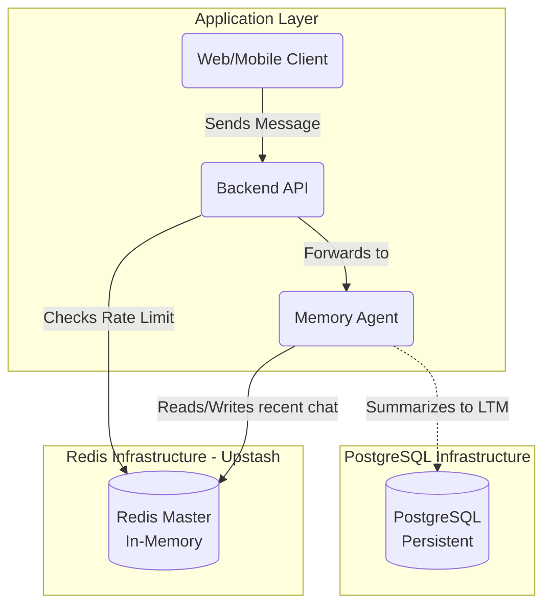
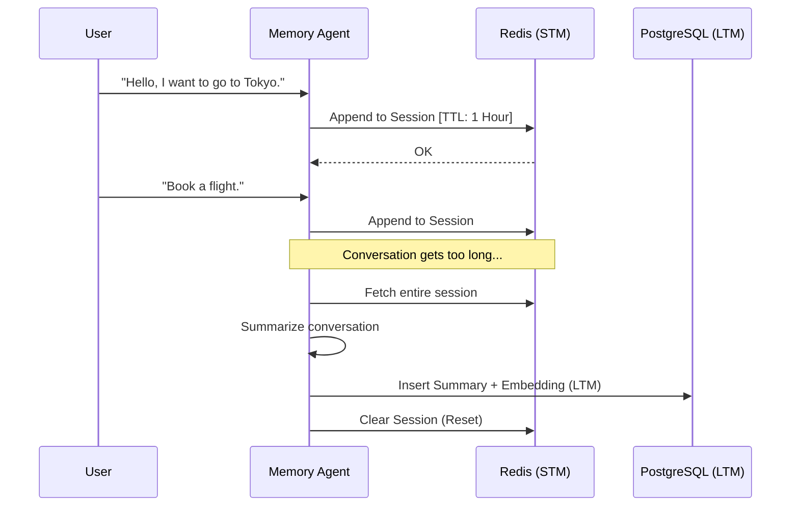

# 05 - Redis: Short-Term Memory & Caching

## 1. Introduction
In the AI Travel Assistant's database architecture, **Redis** operates as the high-speed, in-memory datastore. While PostgreSQL and `pgvector` handle persistent facts and long-term semantic memory, Redis manages ephemeral state. It acts as the conversational buffer (Short-Term Memory) and protects the Backend API through rate limiting and session caching.

## 2. Purpose
The primary purpose of Redis is to offload high-frequency, low-latency workloads from PostgreSQL. In an AI chat application, users expect instantaneous responses. Retrieving the last 5 messages of a conversation directly from disk for every single LLM prompt generation adds unacceptable overhead. Redis stores this exact "sliding window" of context in RAM.

## 3. Problem Statement
If the Memory Agent uses PostgreSQL for immediate chat history:
1. Every keystroke or message creates a database connection overhead.
2. The database fills up with useless "Hi", "Hello", "Thanks" messages that don't need permanent storage.
3. API rate limits (e.g., stopping a malicious user from spamming the LLM) require atomic counters, which cause row-level locking bottlenecks in relational databases.

## 4. Internal Working
Redis solves these issues by operating entirely in memory (RAM).
- **Short-Term Memory (STM):** The Agent uses Redis `LIST`s or `JSON` objects to store the current conversation. When the conversation exceeds a certain token limit, the Agent summarizes it, pushes the summary to PostgreSQL (`pgvector`), and clears the Redis key.
- **Rate Limiting:** The Backend API uses Redis `INCR` commands with a Time-To-Live (TTL) to cheaply and atomically count API requests per user IP.

## 5. Architecture
Below is the architecture demonstrating how Redis fits into the conversational flow.



## 6. Data Flow
1. **User Prompt**: The user asks, "Is it near the airport?"
2. **Context Lookup**: The Memory Agent needs to know what "it" refers to. It queries Redis for the session key `chat:session:12345`.
3. **Cache Hit**: Redis instantly returns the last few messages, revealing "it" refers to the "Hilton Hotel".
4. **Resolution**: The Agent uses this context to query PostgreSQL for the Hilton Hotel's coordinates.
5. **Update**: The user's new prompt and the AI's response are appended to the Redis session key.

## 7. Diagrams (Mermaid)
*Short-Term Memory Lifecycle*



## 8. Best Practices
- **Always set a TTL (Time-To-Live):** Never store data in Redis without an expiration time unless absolutely necessary. For chat sessions, a TTL of 1 to 24 hours is standard.
- **Namespacing Keys:** Use colons to namespace your keys logically (e.g., `rate_limit:api:user_id` or `session:chat:session_id`).
- **Connection Pooling:** Even though Redis is fast, opening a new TCP connection for every command is slow. Maintain a connection pool in the Node.js/Python backend.

## 9. Common Mistakes
- **Treating Redis as Persistent:** Assuming data in Redis will always be there. If the Redis instance restarts, in-memory data might be lost. Always write critical booking data straight to PostgreSQL.
- **Storing Large JSON Objects:** Storing massive objects (like a 5MB JSON array of global airports) in a single Redis key blocks the single-threaded Redis engine when retrieved.

## 10. Production Recommendations
- We recommend **Upstash** or **Amazon ElastiCache** (Serverless). Upstash provides a REST API over Redis, which is perfect for serverless edge functions (like Vercel or AWS Lambda) where maintaining persistent TCP connections is difficult.

## 11. Step-by-Step Implementation
1. Provision a local Redis container using Docker.
2. Implement the Redis client in the Backend API (using `redis-py` or `ioredis`).
3. Create middleware for API rate limiting.
4. Implement the Memory Agent's read/write functions for the conversational sliding window.
5. Implement the logic to flush old Redis data to PostgreSQL LTM.

## 12. Folder Structure
```text
/backend
├── /src
│   ├── /cache
│   │   ├── redis_client.py     # Connection logic
│   │   ├── rate_limiter.py     # API protection
│   │   └── session_store.py    # STM operations
```

## 13. Data Access Examples (NoSQL)
*Note: Redis is a NoSQL Key-Value store, so we use commands rather than SQL.*

```python
# Python pseudo-code for Short-Term Memory logic
import redis

r = redis.Redis(host='localhost', port=6379, db=0)

# Add a message to the chat history list
r.rpush('chat:session:user_123', 'User: I need a hotel in Paris')
r.rpush('chat:session:user_123', 'AI: I can help with that. What is your budget?')

# Set the session to expire in 2 hours (7200 seconds) if inactive
r.expire('chat:session:user_123', 7200)

# Retrieve the last 5 messages for context
history = r.lrange('chat:session:user_123', -5, -1)
```

## 14. Terminal Commands
```bash
# Connect to local Redis Docker container
docker exec -it ai-travel-redis redis-cli

# Inside redis-cli: Check if a key exists
> EXISTS chat:session:user_123

# Inside redis-cli: Monitor all incoming commands in real-time
> MONITOR
```

## 15. Deployment Considerations
- **Eviction Policies:** Configure your Redis cluster with an `allkeys-lru` (Least Recently Used) eviction policy. If RAM gets full, Redis will automatically delete the oldest, unused chat sessions to make room for active ones.

## 16. Security Considerations
- Redis defaults to no password and binds to all interfaces. In production, ensure `REQUIREPASS` is set.
- Do not expose port `6379` to the public internet. Redis should only be accessible from within the private VPC of the Backend API.

## 17. Performance Optimization
- **Pipelining:** If you need to write 10 new variables to Redis, do not send 10 separate commands. Use a Redis Pipeline to send them all in a single network round-trip.

## 18. References
- [Redis Official Documentation](https://redis.io/docs/)
- [Upstash Serverless Redis](https://upstash.com/)
- [Redis Memory Optimization](https://redis.io/docs/management/optimization/memory-optimization/)
