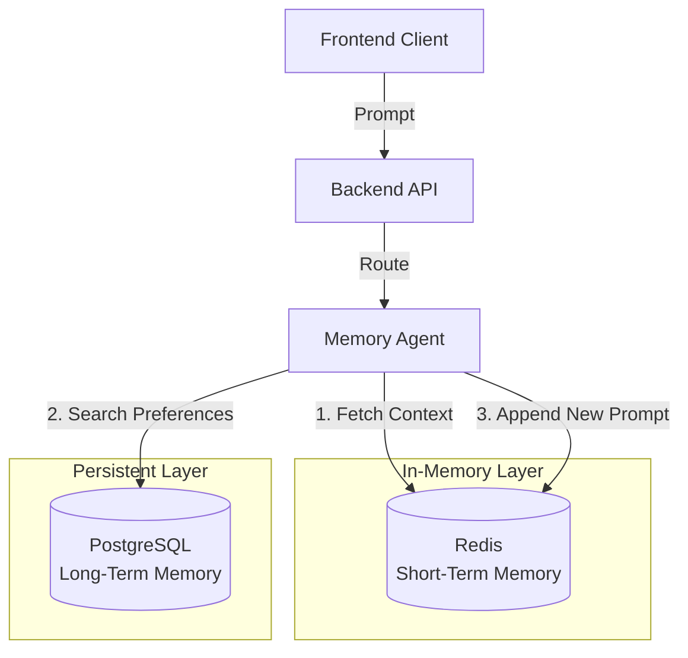
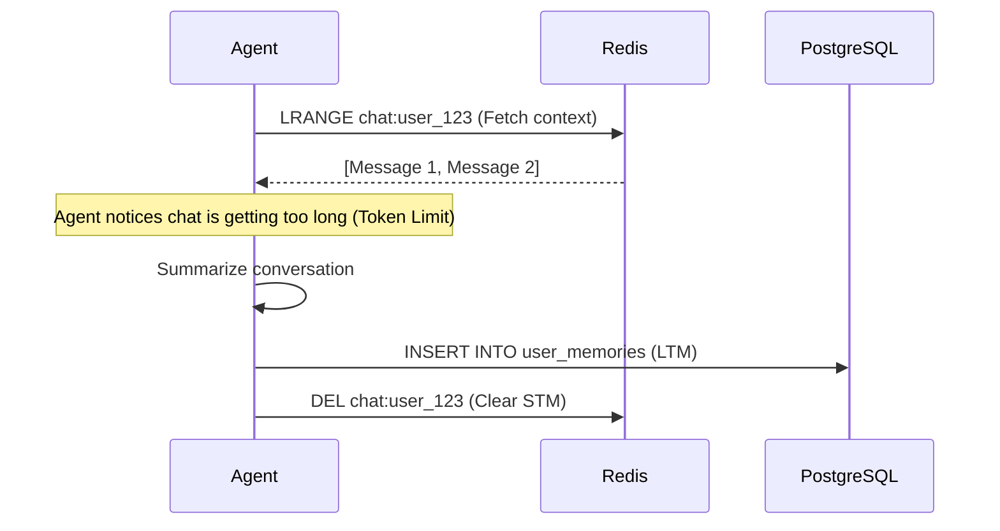

# 06 - Redis: High-Performance Memory & Caching

## 1. What Redis Is
Redis (Remote Dictionary Server) is an open-source, in-memory data structure store. It is fundamentally a NoSQL Key-Value database that stores data in RAM rather than on a physical hard drive. It supports strings, hashes, lists, sets, and JSON. Because it reads and writes to RAM, its performance is measured in microseconds (sub-millisecond latency), making it one of the fastest databases in the world.

## 2. Why Redis Exists
Redis was created to solve the "disk I/O bottleneck." Traditional relational databases (like PostgreSQL) are incredibly durable and structured, but they are inherently limited by the speed at which data can be written to and read from a disk (SSD/HDD). Redis exists to provide an ultra-fast caching layer in front of slower primary databases, handling millions of read/write operations per second.

## 3. Why We Use Redis Instead of PostgreSQL for Short-Term Memory
In an AI Travel Assistant, a user might send 20 messages in a rapid, back-and-forth conversation. The LLM requires the context of the last few messages to answer accurately. 
If we used PostgreSQL for this:
- Every message would require establishing a database connection, parsing SQL, and writing to the WAL (Write-Ahead Log) on disk.
- PostgreSQL's connection limits and CPU would be instantly overwhelmed by trivial conversational state.
By using Redis, we completely offload this ephemeral conversational state. Redis handles the high-frequency reads/writes in RAM, keeping PostgreSQL entirely free to process critical tasks (like booking a flight).

## 4. Internal Architecture
Redis is single-threaded. This design choice guarantees atomic operations (no two commands can execute at the exact same microsecond), which completely eliminates complex race conditions and deadlocks found in multi-threaded databases.

## 5. Key-Value Storage
Unlike PostgreSQL tables with columns and rows, Redis simply maps a string key to a value.
- **Key:** `chat:session:user_123`
- **Value:** `["I want to visit Tokyo", "When are you planning to go?"]` (Stored as a Redis List or JSON).

## 6. Caching
Redis acts as a high-speed cache for the Backend API. If a user queries "List of Airports in Japan," the API first checks Redis. If the data isn't there (a Cache Miss), it queries PostgreSQL, then saves the result in Redis. The next user asking the same question gets the data instantly from Redis (a Cache Hit).

## 7. Sessions
Redis is stateless, meaning it doesn't care about HTTP requests. The AI Travel Assistant uses Redis to track active user sessions. If the user disconnects and reconnects, the Memory Agent fetches the active session ID from Redis to instantly restore the conversational context.

## 8. TTL (Time To Live) & Expiration
Every key in Redis can (and usually should) have a TTL. For example, setting a TTL of `3600` seconds on a chat session means that if the user stops chatting for an hour, Redis automatically deletes the memory, freeing up RAM.

## 9. Persistence Options
Though primarily an in-memory store, Redis can save data to disk so it isn't lost on restart.
- **RDB (Redis Database Snapshot):** Takes point-in-time snapshots of the dataset at specified intervals (e.g., every 5 minutes).
- **AOF (Append Only File):** Logs every single write operation.
*Note:* For our AI Travel Assistant, we disable AOF and rely on RDB because Redis data is considered ephemeral (Short-Term Memory). Long-Term Memory lives safely in PostgreSQL.

## 10. How Redis Communicates with PostgreSQL
Redis **does not** communicate directly with PostgreSQL. The Memory Agent acts as the orchestrator.
1. The Agent reads the short-term chat from Redis.
2. The Agent summarizes the chat.
3. The Agent writes the summary to PostgreSQL (`pgvector`).
4. The Agent deletes the chat from Redis.

## 11. How Redis Fits into the AI Travel Assistant
Redis operates as the first line of defense and the primary working memory for the agent.



## 12. Short-Term Memory Flow


## 13. Docker Setup & Local Development
For local development, we run Redis as a standalone container.
```yaml
# docker-compose.yml snippet
services:
  redis:
    image: redis:7-alpine
    ports:
      - "6379:6379"
    volumes:
      - redis_data:/data
    command: redis-server --save 60 1 --loglevel warning
```

## 14. Production Deployment (Upstash Redis)
In production, we do not deploy Redis in a Docker container. We use **Upstash**, a serverless Redis provider.
- **Why Upstash?** It offers a true serverless pay-per-request pricing model and exposes a REST API. This is critical if the Backend API is deployed on serverless platforms (like Vercel or AWS Lambda) where maintaining persistent TCP connections is highly inefficient.

## 15. Security
- **Authentication:** In Docker, use `--requirepass [password]`. In Upstash, a secure password is auto-generated.
- **Network Isolation:** Upstash allows IP allowlisting so only your Backend API server IP can access the Redis endpoint.
- **TLS:** Always connect via `rediss://` (Redis over SSL) in production.

## 16. Monitoring
- Use the `INFO memory` command to monitor RAM usage.
- Monitor the **Hit Rate**. A low cache hit rate means your TTLs are too short or your caching strategy is flawed, forcing the system to fall back to PostgreSQL too often.

## 17. Performance Optimization
- **Eviction Policies:** Configure Upstash to use `allkeys-lru` (Least Recently Used). If you hit your RAM limit, Redis will automatically delete the oldest, abandoned chat sessions.
- **Pipelining:** Group multiple commands (e.g., setting a session and setting a TTL) into a single pipeline to reduce network round-trips.

## 18. Best Practices
- Never use the `KEYS *` command in production. It locks the single thread and scans the entire database, causing a massive latency spike. Use `SCAN` instead.
- Prefix all keys logically: `rate_limit:ip:192.168.1.1` or `stm:user:98765`.

## 19. Common Mistakes
- **Storing embeddings in Redis:** Arrays of 1536 floats (vectors) consume massive amounts of RAM. Redis should only store the raw text of the conversation. `pgvector` handles the embeddings.
- **Missing TTLs:** Forgetting to set a TTL on session data, causing Redis to slowly bloat until it crashes out of memory.

## 20. Terminal Commands
```bash
# Connect to local Docker Redis with password
docker exec -it ai-travel-redis redis-cli -a my_secure_password

# Set a key with an expiration of 60 seconds
SET mykey "Hello" EX 60

# Check Time-To-Live on a key
TTL mykey

# Add to a list (Short-Term Memory array)
RPUSH chat:123 "User: Hi"
```
