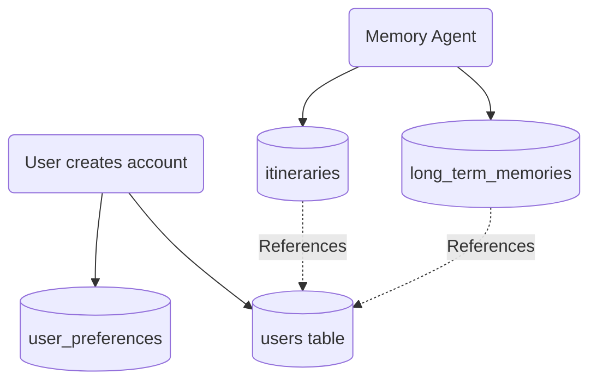

# 08 - Database Schema

## 1. Introduction
The Database Schema is the architectural blueprint of our PostgreSQL database. It defines exactly how the AI Travel Assistant stores users, travel preferences, itineraries, and Long-Term Memory (vectors). A well-designed schema ensures data integrity, enforces rules, and drastically improves query performance.

## 2. Purpose
The purpose of this document is to define the exact tables, columns, data types, constraints, and relationships that make up the AI Travel Assistant's relational data layer. It acts as the ultimate source of truth for backend developers and data engineers interacting with the database.

## 3. Naming Conventions
To maintain professional consistency, this project strictly adheres to **`snake_case`**.
- **Tables:** Plural `snake_case` (e.g., `users`, `travel_itineraries`).
- **Columns:** Singular `snake_case` (e.g., `user_id`, `created_at`).
- **Constraints/Indexes:** `[table]_[column]_[type]` (e.g., `users_email_idx`).

## 4. Internal Working & Architecture
The schema is divided into three logical domains:
1. **User Identity:** Core user accounts and settings.
2. **Travel Data:** Bookings, destinations, and generated itineraries.
3. **Memory Agent:** `pgvector` storage for semantic search and Long-Term Memory (LTM).

## 5. Core Tables

### 5.1. `users` Table
Stores authentication data and high-level profiles.
| Column Name | Data Type | Constraints | Description |
| :--- | :--- | :--- | :--- |
| `id` | `UUID` | `PRIMARY KEY` | Unique identifier. Default: `uuid_generate_v4()`. |
| `email` | `VARCHAR(255)` | `UNIQUE, NOT NULL` | User's email address. |
| `password_hash` | `TEXT` | `NOT NULL` | Bcrypt hashed password. |
| `created_at` | `TIMESTAMPTZ` | `NOT NULL` | Timestamp of registration. Default: `NOW()`. |

### 5.2. `user_preferences` Table
Stores travel preferences to personalize AI recommendations.
| Column Name | Data Type | Constraints | Description |
| :--- | :--- | :--- | :--- |
| `user_id` | `UUID` | `PRIMARY KEY, REFERENCES users(id)` | 1:1 relationship with users. |
| `preferred_currency`| `CHAR(3)` | `NOT NULL` | E.g., 'USD', 'EUR', 'JPY'. |
| `dietary_restrictions`| `JSONB` | `NULL` | Array of strings (e.g., `["vegan", "halal"]`). |

### 5.3. `destinations` Table
A catalog of global locations the AI can recommend.
| Column Name | Data Type | Constraints | Description |
| :--- | :--- | :--- | :--- |
| `id` | `SERIAL` | `PRIMARY KEY` | Auto-incrementing integer. |
| `name` | `VARCHAR(100)` | `NOT NULL` | E.g., 'Paris', 'Mount Fuji'. |
| `country` | `VARCHAR(100)` | `NOT NULL` | Country name. |
| `description` | `TEXT` | `NOT NULL` | Context for the AI. |

### 5.4. `itineraries` Table
Trips generated by the AI Memory Agent.
| Column Name | Data Type | Constraints | Description |
| :--- | :--- | :--- | :--- |
| `id` | `UUID` | `PRIMARY KEY` | Unique trip identifier. |
| `user_id` | `UUID` | `REFERENCES users(id)` | The user who owns this trip. |
| `title` | `VARCHAR(255)` | `NOT NULL` | E.g., 'Summer in Tokyo'. |
| `start_date` | `DATE` | `NOT NULL` | Trip departure. |
| `end_date` | `DATE` | `NOT NULL` | Trip return. |

### 5.5. `long_term_memories` Table (pgvector)
This is where the Memory Agent stores semantic vectors.
| Column Name | Data Type | Constraints | Description |
| :--- | :--- | :--- | :--- |
| `id` | `UUID` | `PRIMARY KEY` | Unique memory ID. |
| `user_id` | `UUID` | `REFERENCES users(id)` | Tie memory to a specific user. |
| `memory_text` | `TEXT` | `NOT NULL` | The raw text of the memory (e.g., "User hates flying on Tuesdays"). |
| `embedding` | `vector(1536)` | `NOT NULL` | OpenAI embedding of the text. |
| `created_at` | `TIMESTAMPTZ` | `NOT NULL` | When the memory was formed. |

## 6. Data Flow


## 7. Best Practices
- **Use UUIDs for primary keys:** For tables exposed to the API (like `users` or `itineraries`), UUIDs prevent attackers from guessing sequential user IDs (Insecure Direct Object Reference).
- **Use `TIMESTAMPTZ`:** Never use standard `TIMESTAMP`. Always store times with Timezone awareness to prevent nightmare bugs when users cross travel time zones.
- **Foreign Key Cascades:** Only use `ON DELETE CASCADE` thoughtfully. Deleting a user should cascade and delete their preferences, but maybe not their financial transaction logs.

## 8. Common Mistakes
- **Storing arrays as comma-separated strings:** Do not use `VARCHAR(255)` to store `"vegan, halal"`. Use PostgreSQL's native `JSONB` or `TEXT[]` arrays so you can query them efficiently.
- **Missing Indexes on Foreign Keys:** PostgreSQL does not automatically index foreign keys. We must manually create an index on `itineraries.user_id` to prevent slow lookups.

## 9. Security Considerations
- Ensure Row-Level Security (RLS) is applied if exposing this schema directly via PostgREST or Supabase. Otherwise, the Backend API (FastAPI) must strictly enforce that User A cannot `SELECT * FROM itineraries WHERE user_id = User_B`.

## 10. Performance Considerations
The `long_term_memories` table will grow exponentially as users chat with the AI. We must use an HNSW index on the `embedding` column.
```sql
CREATE INDEX ltm_embedding_idx ON long_term_memories USING hnsw (embedding vector_cosine_ops);
```

## 11. Real-World Example
If a user tells the chatbot: *"I want to go to Paris, but I'm allergic to peanuts."*
1. The Backend updates `user_preferences.dietary_restrictions` with `"peanut allergy"`.
2. The Agent creates a new row in `long_term_memories` with the text and its 1536-dimension embedding.
3. Next year, when they ask for a trip to Tokyo, the Agent searches `long_term_memories`, retrieves the allergy, and ensures the Tokyo itinerary excludes peanut-heavy restaurants.

## 12. Summary
This schema is designed to be lean but highly scalable. It utilizes standard relational integrity for rigid data (users, trips) while heavily leaning on `JSONB` for flexible data (preferences) and `pgvector` for semantic AI memory. In the next document, we will visualize how these tables interconnect using an ER Diagram.
