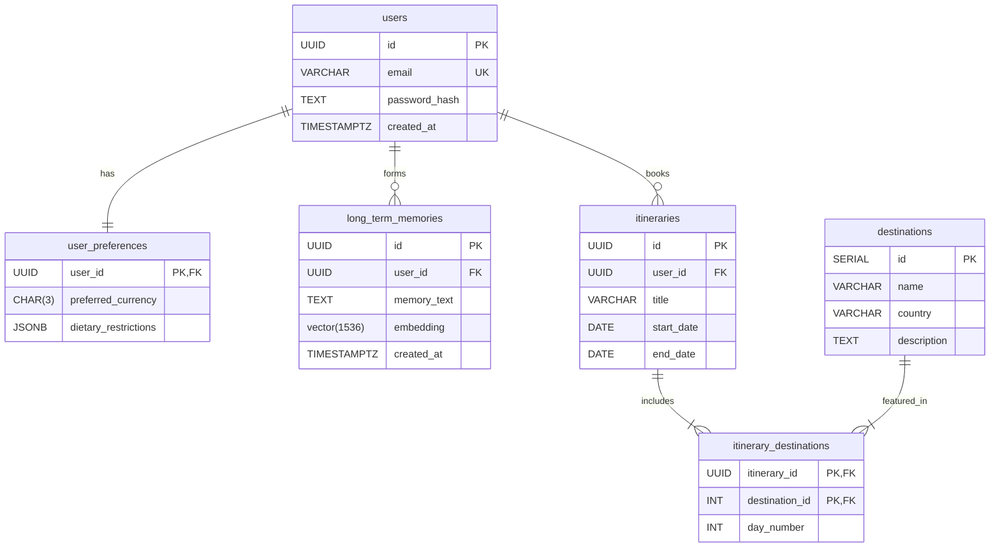

# 09 - Entity Relationship (ER) Diagram

## 1. Introduction
An Entity Relationship (ER) Diagram is a visual representation of the Database Schema. It illustrates how different entities (tables) in the database relate to one another using primary and foreign keys.

## 2. Purpose
While `08_Database_Schema.md` explains *what* columns and data types exist, this document explains *how* those tables interconnect. Database Engineers and Backend Developers use ER diagrams to instantly understand the database's structural integrity and data flow without reading thousands of lines of SQL.

## 3. Core Relationships Explained
In relational databases, tables connect in three main ways:
1. **One-to-One (1:1):** A `user` has exactly one `user_preference` profile.
2. **One-to-Many (1:M):** A `user` can have many `long_term_memories` and many `itineraries`.
3. **Many-to-Many (M:N):** An `itinerary` can include many `destinations`, and a `destination` can belong to many `itineraries`. This requires a "Join Table" (e.g., `itinerary_destinations`).

## 4. Mermaid ER Diagram
Below is the complete architectural ER diagram for the AI Travel Assistant, rendered using GitHub-supported Mermaid `erDiagram` syntax.

### 4.1. Diagram Key (Crow's Foot Notation)
- `||--||` : Exactly One (1:1). Every user must have exactly one preference row.
- `||--o{` : Zero or Many (1:M). A user might have zero memories, or they might have thousands.
- `||--|{` : One or Many (1:M). An itinerary must have at least one destination linked via the join table.

## 5. Join Tables (Many-to-Many)
Notice the `itinerary_destinations` table in the diagram.
PostgreSQL does not natively support Many-to-Many links. If a user's trip to Europe includes London, Paris, and Rome, we cannot easily store that in a single column.
Instead, we create `itinerary_destinations`. It contains the `itinerary_id` and the `destination_id`. This allows an unlimited number of destinations per trip, and allows "Paris" to be referenced across thousands of different users' trips seamlessly.

## 6. Architecture & Data Integrity
The ER diagram enforces strict architectural rules via **Foreign Key Constraints**.
- If the AI Memory Agent tries to insert a memory for a `user_id` that doesn't exist in the `users` table, PostgreSQL will instantly throw a `Foreign Key Violation` error and block the insert. This guarantees our data never becomes "orphaned."

## 7. Best Practices
- **Visual Clarity:** Keep ER diagrams updated. A stale ER diagram is worse than no ER diagram because it misleads developers.
- **Composite Primary Keys:** In the `itinerary_destinations` join table, the combination of `(itinerary_id, destination_id)` acts as the primary key. This prevents a bug where the exact same destination is accidentally added to the exact same trip twice.

## 8. Common Mistakes
- **Circular Dependencies:** Designing tables where Table A requires Table B to exist, and Table B requires Table A to exist. This creates an impossible insertion loop. The ER diagram helps spot these loops visually.
- **Over-Normalization:** Creating too many join tables. Sometimes, if a piece of data is simple (like an array of dietary tags), using a single `JSONB` column is vastly superior to creating a whole `dietary_tags` table and a `user_dietary_tags` join table.

## 9. Production Recommendations
Before writing a single line of backend code or executing `CREATE TABLE` scripts, the database engineering team must sit together, review this ER Diagram, and formally sign off on it. Schema changes are cheap on a whiteboard (or in Markdown), but incredibly expensive and dangerous once production data is flowing.

## 10. Summary
This ER Diagram visualizes the backbone of the AI Travel Assistant. It elegantly links traditional authentication and booking logic with cutting-edge vector storage (`long_term_memories`). With this visual map approved, the next logical step is to turn these concepts into actual execution scripts, which we will cover in the **SQL Guide**.
