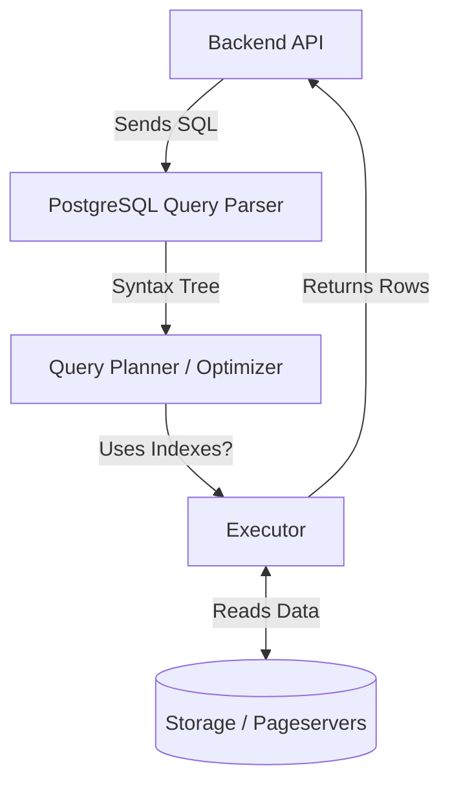

# 10 - SQL Guide

## 1. Introduction
The SQL Guide provides the foundational scripts and querying strategies used in the AI Travel Assistant. It bridges the theoretical concepts from the Database Schema and ER Diagram into executable PostgreSQL commands.

## 2. Purpose
This document serves as the primary reference for Backend Developers and Database Engineers to safely initialize the database, execute complex joins, and perform semantic vector searches without degrading performance.

## 3. Internal Working
The system relies on PostgreSQL's robust SQL engine. It strictly adheres to ACID (Atomicity, Consistency, Isolation, Durability) properties. The SQL queries here assume the use of `pgvector` for Long-Term Memory (LTM) operations and standard B-Tree indexes for relational operations.

## 4. DDL: Database Initialization
Before writing data, we must create the schema. *Note: We strongly recommend running these via a migration tool like Alembic or Flyway in production, rather than manually.*

```sql
-- 1. Enable the pgvector extension (Required for Memory Agent)
CREATE EXTENSION IF NOT EXISTS vector;

-- 2. Create the Users Table
CREATE TABLE users (
    id UUID PRIMARY KEY DEFAULT gen_random_uuid(),
    email VARCHAR(255) UNIQUE NOT NULL,
    password_hash TEXT NOT NULL,
    created_at TIMESTAMPTZ NOT NULL DEFAULT NOW()
);

-- 3. Create the User Preferences Table (1:1 Relationship)
CREATE TABLE user_preferences (
    user_id UUID PRIMARY KEY REFERENCES users(id) ON DELETE CASCADE,
    preferred_currency CHAR(3) NOT NULL DEFAULT 'USD',
    dietary_restrictions JSONB DEFAULT '[]'::jsonb
);

-- 4. Create the Long-Term Memories Table (pgvector)
CREATE TABLE long_term_memories (
    id UUID PRIMARY KEY DEFAULT gen_random_uuid(),
    user_id UUID REFERENCES users(id) ON DELETE CASCADE,
    memory_text TEXT NOT NULL,
    embedding vector(1536) NOT NULL,
    created_at TIMESTAMPTZ NOT NULL DEFAULT NOW()
);

-- 5. Create an HNSW Index on the embedding column for lightning-fast semantic search
CREATE INDEX ltm_embedding_idx ON long_term_memories 
USING hnsw (embedding vector_cosine_ops);
```

## 5. DML: Data Flow & Queries
How data is inserted and retrieved by the Backend API and Memory Agent.

### 5.1. Inserting a New User
```sql
INSERT INTO users (email, password_hash) 
VALUES ('traveler@example.com', '$2b$12$hashedpassword')
RETURNING id;
```

### 5.2. Semantic Search (pgvector)
When a user asks: "Find me a memory about my allergies." The backend generates an embedding (a massive array of 1536 floats) and queries PostgreSQL for the top 3 most semantically similar memories using the `<=>` (Cosine Distance) operator.

```sql
-- Find the 3 most relevant memories for this specific user
SELECT memory_text 
FROM long_term_memories 
WHERE user_id = 'a1b2c3d4-e5f6-7890-1234-56789abcdef0'
ORDER BY embedding <=> '[0.123, -0.456, 0.789, ...]'::vector 
LIMIT 3;
```

### 5.3. Complex Relational Retrieval
Retrieve a user's full profile, including their parsed JSONB preferences.

```sql
SELECT 
    u.email, 
    p.preferred_currency, 
    p.dietary_restrictions
FROM users u
JOIN user_preferences p ON u.id = p.user_id
WHERE u.id = 'a1b2c3d4-e5f6-7890-1234-56789abcdef0';
```

## 6. Architecture of a Query


## 7. Best Practices
- **Always use Parameterized Queries:** Never concatenate user input directly into SQL strings in your backend code. This prevents SQL Injection attacks.
- **Use `RETURNING`:** PostgreSQL allows you to return the generated UUID of an inserted row instantly using `RETURNING id;`, eliminating the need for a secondary `SELECT` query.
- **Index Foreign Keys:** Manually create B-Tree indexes on all foreign key columns (like `user_id` in `long_term_memories`) to speed up `JOIN` and `WHERE` clauses.

## 8. Common Mistakes
- **`SELECT *` in Production:** Avoid using `SELECT *`. It retrieves more data than needed, wasting network bandwidth and RAM. Explicitly list the columns you need: `SELECT id, email FROM users;`.
- **Querying JSONB poorly:** Using a `LIKE` statement on a JSONB column is extremely slow. Use the native `?` or `@>` operators.
  - *Correct:* `WHERE dietary_restrictions @> '["vegan"]'`

## 9. Security Considerations
- **Role-Based Access Control (RBAC):** Create a dedicated `api_user` role in PostgreSQL. The API should *never* connect to the database as the `postgres` superuser.
```sql
CREATE ROLE api_user WITH LOGIN PASSWORD 'secure_pass';
GRANT SELECT, INSERT, UPDATE, DELETE ON ALL TABLES IN SCHEMA public TO api_user;
```

## 10. Performance Considerations
- Use `EXPLAIN ANALYZE` before deploying a new query to production. If the output says `Seq Scan` (Sequential Scan) on a table with 10 million rows, you are missing an index and the query will be catastrophically slow.

## 11. Terminal Commands
```bash
# Connect to PostgreSQL via psql to execute queries
psql -U postgres -d ai_travel -h localhost -p 5432

# Inside psql: Analyze query performance
EXPLAIN ANALYZE SELECT * FROM users WHERE email = 'test@test.com';
```

## 12. Summary
SQL is the language that powers the relational aspects of the AI Travel Assistant. By understanding how to efficiently join tables and correctly utilize `pgvector` operators (`<=>`), we ensure that the Memory Agent can recall context instantly. The next document will dive specifically into how these vectors (Embeddings) actually work behind the scenes.
