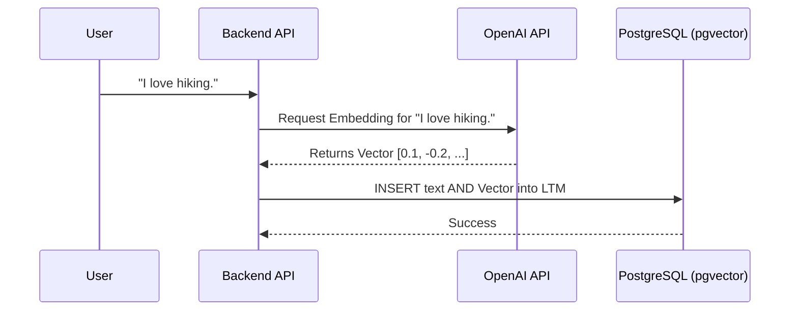

# 11 - Embeddings

## 1. Introduction
Embeddings are the secret sauce that makes the AI Travel Assistant "smart." In standard databases, you can only search for exact keyword matches (e.g., `WHERE memory_text LIKE '%pizza%'`). Embeddings allow the database to understand *meaning*, enabling semantic search (e.g., matching "I want a slice in New York" with "pizza").

## 2. Purpose
This document explains what vector embeddings are, how they are generated, and how PostgreSQL (via `pgvector`) stores and searches them to form the AI's Long-Term Memory (LTM).

## 3. What is a Vector Embedding?
An embedding is a translation of text into an array (a vector) of floating-point numbers. Machine Learning models (like OpenAI's `text-embedding-3-small`) read a sentence and output an array of exactly 1,536 numbers. These numbers represent the semantic "coordinates" of that sentence in a 1,536-dimensional space.
- Concepts that are similar (like "Dog" and "Puppy") will have coordinates that are very close to each other.
- Concepts that are unrelated (like "Dog" and "Airplane") will be far apart.

## 4. Internal Working & Data Flow
1. **User Input:** The user says, "I hate cold weather."
2. **LLM Generation:** The Backend API sends this text to OpenAI.
3. **Vector Return:** OpenAI returns an array: `[0.012, -0.045, 0.887, ...]` (1,536 dimensions).
4. **Storage:** The Memory Agent saves the text and the array into the `long_term_memories` table in PostgreSQL.
5. **Retrieval:** Weeks later, the user asks, "Where should I go for vacation?" The API embeds this new question, asks `pgvector` to find the closest vectors in the database, and `pgvector` instantly returns "I hate cold weather."

## 5. Architecture: The Embedding Pipeline


## 6. How pgvector Works
`pgvector` is an extension that adds a new native data type to PostgreSQL called `vector`.
- It allows you to store arrays of floats efficiently.
- It overloads standard SQL operators to perform vector math. The most important operator is `<=>`, which calculates **Cosine Distance**.

### Cosine Distance (Similarity)
Cosine Distance measures the angle between two vectors. 
- A distance of `0.0` means the vectors are pointing in the exact same direction (identical meaning).
- A distance of `1.0` means they are orthogonal (unrelated).
- A distance of `2.0` means they are exact opposites.

## 7. Best Practices
- **Standardize Dimensions:** Always ensure the column dimension size matches your LLM model. OpenAI `text-embedding-3-small` uses 1536. If you try to insert a 1535-dimension vector into a `vector(1536)` column, PostgreSQL will throw an error.
- **Normalize Vectors:** OpenAI embeddings are pre-normalized to a length of 1. Because they are normalized, Cosine Distance (`<=>`) and Inner Product (`<#>`) will yield the exact same ranking, but Inner Product is slightly faster for the CPU to compute.

## 8. Common Mistakes
- **Forgetting the Index:** If you do not add an HNSW index to your vector column, `pgvector` will perform an Exact Nearest Neighbor (KNN) search. This means it calculates the math against *every single row* in the database. With 1 million memories, this will cause a massive CPU spike.
- **Embedding Huge Chunks of Text:** Do not embed an entire 5-page PDF into a single vector. The "meaning" gets diluted. Chunk the text into paragraphs, embed each paragraph, and store them as separate rows.

## 9. Performance Considerations (HNSW Indexes)
To scale vector search, we use **HNSW** (Hierarchical Navigable Small World) indexes. 
An HNSW index creates a graph of vectors, allowing the database to "hop" from node to node to find the nearest neighbors in milliseconds, even with billions of rows. It is an *Approximate* Nearest Neighbor (ANN) search, meaning it trades a tiny bit of accuracy for a massive boost in speed.

```sql
-- Creating an HNSW index
CREATE INDEX ltm_hnsw_idx ON long_term_memories 
USING hnsw (embedding vector_cosine_ops)
WITH (m = 16, ef_construction = 64);
```

## 10. Security Considerations
- **PII in Vectors:** Remember that vectors represent raw text. If you embed Personally Identifiable Information (PII) like a passport number, that vector can be reverse-engineered or matched. Treat vector columns with the same security classification as plaintext columns.

## 11. Real-World Example
**Question:** "Find me a beach resort."
**Database Action:** The AI embeds the question. `pgvector` scans the `destinations` table (assuming we embedded destination descriptions) and returns "Maldives" and "Bali" because their vectors are grouped in the "tropical/ocean" semantic cluster, even if the word "beach" wasn't explicitly in their descriptions.

## 12. Summary
Embeddings transform PostgreSQL from a rigid data store into a semantic brain. By converting text into 1,536-dimensional coordinates, the AI Travel Assistant can effortlessly connect concepts, recall memories, and understand user intent. In the next document, we will explore the complete **Memory System**, which combines these Long-Term Embeddings with Redis Short-Term Memory.
