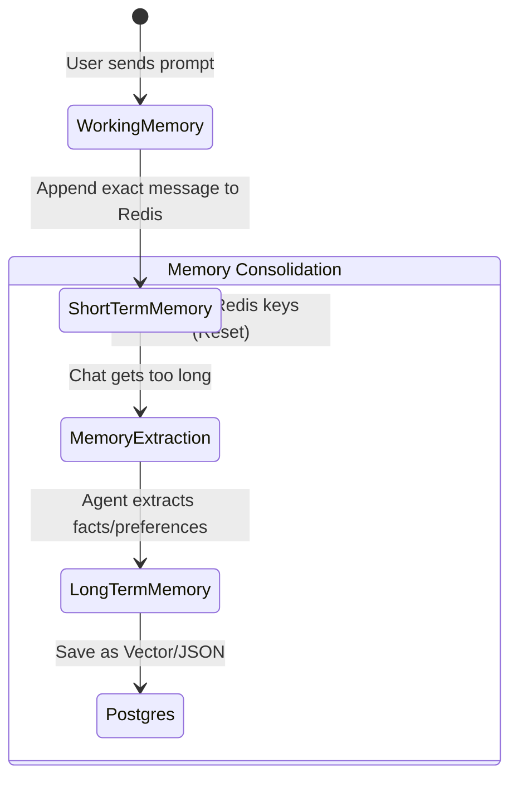

# 12 - Memory System

## 1. Introduction
The Memory System is the cognitive framework that allows the AI Travel Assistant to remember user interactions over time. Just like a human travel agent remembers your budget from 5 minutes ago and your allergy from 2 years ago, the Memory System coordinates different storage technologies to replicate human memory.

## 2. Purpose
Without a Memory System, an LLM (Large Language Model) has amnesia. It treats every single prompt as if it is speaking to you for the very first time. The purpose of this system is to capture, classify, and store context so that conversations feel continuous, personalized, and intelligent.

## 3. Cognitive Architecture (Types of Memory)
The AI Travel Assistant breaks memory down into three distinct operational types:

### 3.1. Working Memory (LLM Context Window)
- **What it is:** The actual tokens sent to the LLM in the current API request.
- **Where it lives:** Nowhere (ephemeral). It is dynamically constructed by the backend on every request.
- **Example:** The immediate system prompt and the retrieved context inserted into the prompt.

### 3.2. Short-Term Memory (STM)
- **What it is:** The exact, word-for-word transcript of the current conversational session.
- **Where it lives:** **Redis**.
- **Why:** To maintain conversational flow (e.g., User: "How much does it cost?", AI: "The Tokyo flight is $500", User: "Book *it*."). The AI needs STM to know "it" refers to the Tokyo flight.

### 3.3. Long-Term Memory (LTM)
Long-Term Memory is permanently persisted and split into two sub-categories:
1. **Semantic Memory (Facts):** General knowledge and explicitly stated user preferences (e.g., "User is vegetarian"). Stored in PostgreSQL as `JSONB` and `vector(1536)`.
2. **Episodic Memory (Events):** Historical records of past trips (e.g., "User went to Paris in 2024"). Stored in PostgreSQL as standard relational rows in the `itineraries` table.

## 4. Memory Lifecycle

## 5. Memory Importance Scoring
Not all memories are equal. "I like window seats" is a high-importance memory. "Hello" is a low-importance memory.
When the system consolidates STM into LTM, it uses an LLM to assign an **Importance Score** (1-10) to the extracted fact.
- Only facts with a score of 5 or higher are embedded and saved to `pgvector`. This prevents the database from bloating with useless conversational filler.

## 6. Memory Expiration
- **Short-Term Memory:** Controlled by a strict Redis TTL (Time-To-Live). If a user goes silent for 2 hours, the session expires. The conversational context is lost, mimicking a human forgetting what they were just talking about after a break.
- **Long-Term Memory:** Never automatically expires, but can be explicitly overwritten or deleted.

## 7. Memory Update Strategy (Conflict Resolution)
What happens if the database has a memory saying "User is vegan" (from 2023) and the user just said "I want a steak" (in 2024)?
1. The Agent retrieves the old LTM ("vegan").
2. The Agent detects a conflict with the new STM ("steak").
3. The Agent generates an updated memory: "User was vegan, but now eats meat."
4. The old vector is `DELETED` from `long_term_memories`, and the new vector is `INSERTED`.

## 8. Best Practices
- **Strict TTLs:** Never let Short-Term Memory live indefinitely in Redis. 
- **Graceful Degradation:** If Redis crashes, the AI should still function (albeit without immediate conversational flow), relying only on LTM from PostgreSQL.

## 9. Common Mistakes
- **Stuffing the Context Window:** Trying to cram every LTM the user has ever generated into the Working Memory. This causes the LLM to hallucinate or "forget" the actual prompt (the "Lost in the Middle" phenomenon).

## 10. Summary
The Memory System maps human cognitive processes to database technologies. Redis handles the fast, fleeting Short-Term Memory, while PostgreSQL and `pgvector` handle the permanent Long-Term Memory. In the next document, we explore the **Memory Agent**, the active background worker responsible for moving data between these layers.
