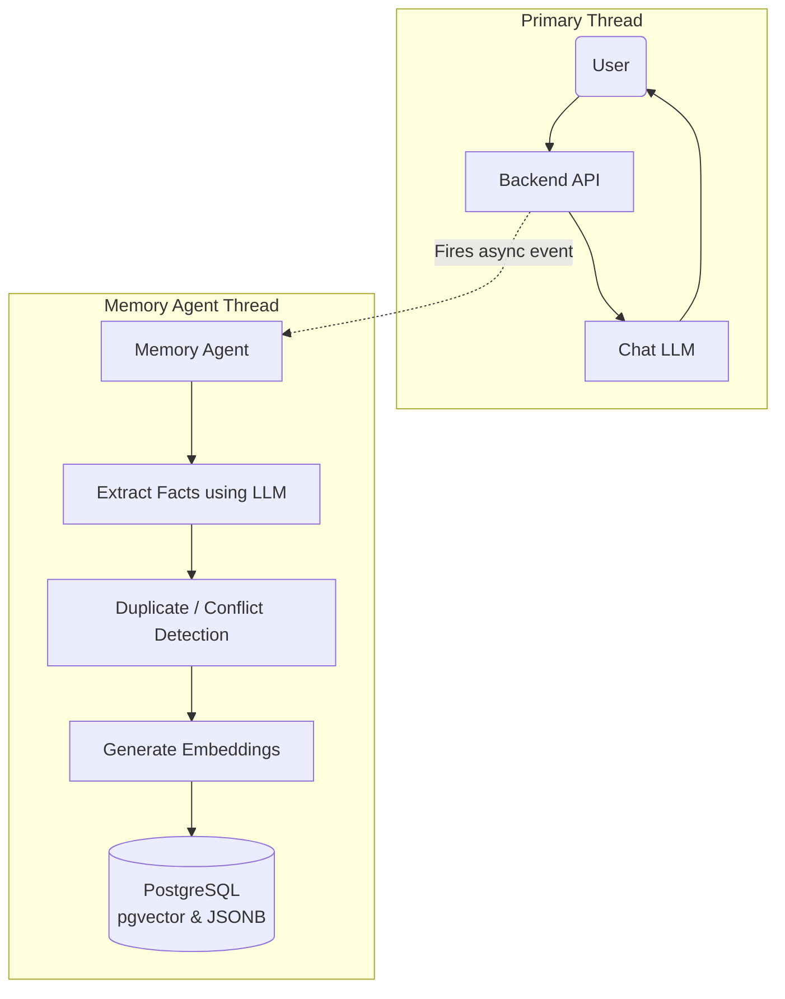

# 13 - Memory Agent

## 1. Introduction
The Memory Agent is a specialized background service (or background task) within the AI Travel Assistant's backend. While the primary LLM is busy talking to the user, the Memory Agent silently observes the conversation, extracting facts, generating embeddings, and writing to the database.

## 2. Purpose
If we force the primary chat LLM to both reply to the user *and* manage database state simultaneously, the response time will be agonizingly slow. The Memory Agent operates asynchronously to handle the heavy lifting of Memory Extraction, Conflict Resolution, and Database Storage, ensuring the user gets a fast chat response.

## 3. The Complete Pipeline


## 4. Memory Extraction
Every time a conversation reaches a certain length (e.g., 5 messages), the Memory Agent reads the Short-Term Memory (STM) from Redis. It asks a fast, cheap LLM (like GPT-4o-mini) to extract standalone facts.
*Input:* "Yeah, my wife is allergic to shellfish, so let's avoid seafood restaurants on our trip to Miami."
*Extracted Facts:* 
1. "User's wife is allergic to shellfish."
2. "User is planning a trip to Miami."

## 5. Duplicate Detection & Conflict Resolution
Before writing to the database, the Agent searches `pgvector` for existing memories similar to the newly extracted facts.
- **Duplicate Detection:** If it extracts "User's wife is allergic to shellfish" but that exact memory already exists in PostgreSQL with a cosine distance `< 0.05`, the Agent safely discards the new fact.
- **Conflict Resolution:** If the user previously said "I love seafood" but now says "I am allergic to shellfish," the Agent triggers a database `UPDATE`, replacing the old conflicting memory with the new truth.

## 6. Embedding Generation
Once a fact is verified as new and non-conflicting, the Memory Agent sends the text to the Embedding Model (e.g., OpenAI `text-embedding-3-small`). The API returns a 1536-dimensional vector array.

## 7. PostgreSQL & pgvector Storage
The Memory Agent writes the final data to the database using an atomic SQL transaction.

```sql
-- Transaction block ensuring data integrity
BEGIN;

-- Insert into Long Term Memories
INSERT INTO long_term_memories (user_id, memory_text, embedding)
VALUES (
    'a1b2c3d4...', 
    'User''s wife is allergic to shellfish.', 
    '[0.12, -0.45, 0.78, ...]'::vector
);

-- Simultaneously update rigid relational preferences if applicable
UPDATE user_preferences 
SET dietary_restrictions = dietary_restrictions || '["shellfish_allergy"]'::jsonb
WHERE user_id = 'a1b2c3d4...';

COMMIT;
```

## 8. Redis Interaction
Once the `COMMIT` is successful, the Memory Agent has effectively "consolidated" the short-term conversation into long-term storage. It then sends a command to Redis to `DEL` or trim the Short-Term Memory session list, freeing up RAM and preventing the chat context window from exceeding token limits.

## 9. Best Practices
- **Asynchronous Execution:** Always run the Memory Agent using an asynchronous task queue like Celery (Python) or BullMQ (Node.js). Never block the main HTTP request waiting for the Memory Agent to finish embedding generation.
- **Batching:** If the Agent extracts 5 facts, do not make 5 separate API calls to the Embedding Model. Batch them into a single API call to reduce latency and costs.

## 10. Common Mistakes
- **Extracting Temporal Facts:** Extracting "User is traveling tomorrow" is a dangerous memory. In two weeks, "tomorrow" will be historically inaccurate. The Memory Agent must be explicitly prompted to convert temporal words into absolute dates (e.g., "User is traveling on Oct 12, 2024").

## 11. Security
The Memory Agent has high-level write access to the `long_term_memories` and `user_preferences` tables. It must use a restricted PostgreSQL role that only has `INSERT` and `UPDATE` permissions on specific tables, preventing it from accidentally dropping tables if a malicious prompt injection attack occurs.

## 12. Summary
The Memory Agent is the automated brain working behind the scenes. It acts as the bridge between Redis (where conversations happen) and PostgreSQL (where knowledge is permanently kept). With memories safely stored, we must now understand how to fetch them back into a conversation using the **Retrieval Pipeline**.
