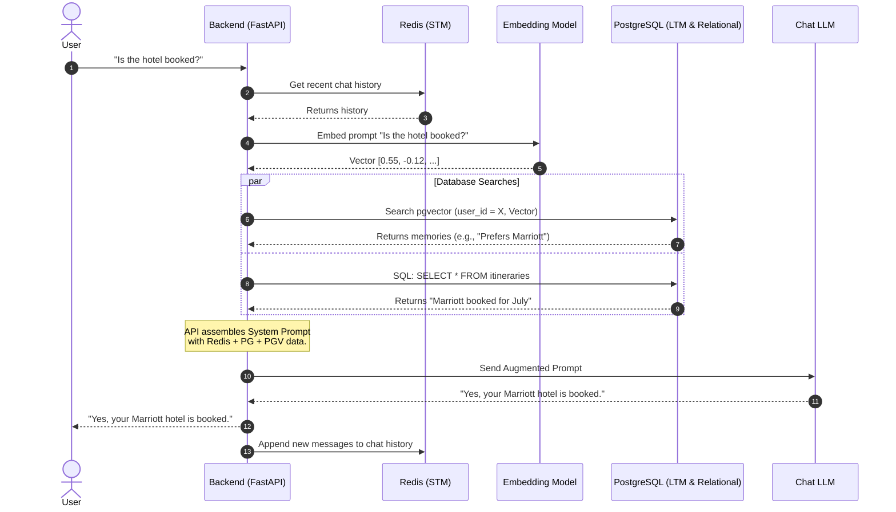

# 15 - RAG Pipeline

## 1. Introduction
RAG stands for **Retrieval-Augmented Generation**. It is the industry-standard architecture for building AI applications that require external knowledge. By combining the concepts from the Database Schema, the Memory Agent, and the Retrieval Pipeline, we form the complete RAG Pipeline for the AI Travel Assistant.

## 2. Purpose
LLMs are trained on public data up to a specific cutoff date. They know nothing about your private database, they don't know who the current user is, and they hallucinate when they don't know the answer. The RAG Pipeline solves this by **Retrieving** facts from PostgreSQL and **Augmenting** the prompt before the LLM **Generates** the answer.

## 3. End-to-End RAG Workflow
The complete RAG pipeline is a synchronous loop triggered by the user.

1. **Receive:** The Backend receives the user's HTTP request containing the prompt.
2. **Contextualize (Redis):** Fetch the last 5 messages from Redis (Short-Term Memory).
3. **Embed:** Convert the current prompt into a 1536-dimensional vector.
4. **Retrieve (pgvector):** Perform an HNSW semantic search for the user's Long-Term Memories.
5. **Retrieve (SQL):** Query standard relational tables for bookings/preferences.
6. **Augment:** Construct a massive string (the System Prompt) containing the STM, LTM, and SQL data.
7. **Generate:** Send the Augmented Prompt to the LLM (e.g., GPT-4o).
8. **Respond:** Stream the generated text back to the user.
9. **Persist:** Background the Memory Agent to evaluate if this interaction should become a new Long-Term Memory.

## 4. Complete Sequence Diagram
Below is the definitive, GitHub-compatible sequence diagram mapping the entire RAG lifecycle.

## 5. Performance Considerations
A poorly designed RAG pipeline feels sluggish. To achieve sub-second response times:
- **Streaming:** Do not wait for the LLM to finish generating the entire 500-word response. Use Server-Sent Events (SSE) or WebSockets to stream the response token-by-token back to the user, creating perceived instantaneity.
- **Connection Pooling:** Ensure the Backend uses a connection pooler (like PgBouncer via Neon) so it doesn't waste 50ms opening a new TCP connection to PostgreSQL on every user prompt.

## 6. Failure Handling (Graceful Degradation)
In production systems, third-party APIs (like OpenAI embeddings) or databases (Redis) can momentarily fail.
- **If Redis fails:** The backend should log the error and proceed without Short-Term Memory. The AI will still work but might ask clarifying questions.
- **If the Embedding API fails:** The backend should bypass `pgvector` retrieval and rely solely on standard SQL relational data.
- **If PostgreSQL fails:** The application is fundamentally broken. Return a `503 Service Unavailable` to the user gracefully.

## 7. Production Best Practices
- **Cache Embeddings:** If users frequently ask the exact same generic questions (e.g., "What are your refund policies?"), cache the query vector in Redis to avoid hitting the OpenAI Embedding API repeatedly.
- **Re-ranking:** If you retrieve 10 memories from `pgvector`, use a fast, local Cross-Encoder model to re-rank them from 1 to 10 based on exact relevance before injecting them into the prompt. This drastically reduces hallucinations.

## 8. Summary
The RAG Pipeline is the culmination of our entire database architecture. Redis provides the immediate conversational flow, PostgreSQL provides the rigid facts, and `pgvector` provides the semantic intelligence. With the application logic fully documented, our next phase focuses heavily on DevOps: moving this architecture from a local laptop to the cloud in the **Deployment** guide.
