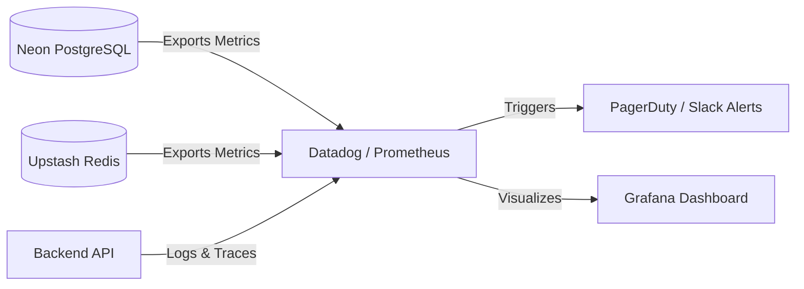

# 19 - Monitoring & Observability

## 1. Introduction
Monitoring and Observability form the dashboard of your database infrastructure. If Performance Optimization is the engine, Monitoring is the speedometer and the check-engine light. It tells you exactly what is happening inside PostgreSQL and Redis at any given millisecond.

## 2. Purpose
Without monitoring, a database failure is a mystery. Is the AI Travel Assistant slow because OpenAI is down, because Redis is out of RAM, or because a PostgreSQL query is missing an index? This document outlines how to track health, gather metrics, and set up alerts so engineers are notified *before* the users notice a problem.

## 3. PostgreSQL Monitoring
The single most important tool in PostgreSQL monitoring is the `pg_stat_statements` extension. It records statistics about all SQL statements executed by the database.

### Enabling pg_stat_statements
```sql
CREATE EXTENSION IF NOT EXISTS pg_stat_statements;
```

### Finding Slow Queries
You can query this view to find the queries taking the longest total time across your entire app:
```sql
SELECT query, calls, total_exec_time, mean_exec_time
FROM pg_stat_statements
ORDER BY total_exec_time DESC
LIMIT 5;
```
If a query has 1,000,000 calls and a high `mean_exec_time`, optimizing it (e.g., adding an index) will massively reduce CPU load.

## 4. Redis Monitoring
Redis provides an incredibly detailed built-in command for monitoring its health: `INFO`.

```bash
# Connect to Redis and run:
> INFO memory
```
**Key Metrics to watch:**
- `used_memory`: Total RAM in use.
- `evicted_keys`: If this number is skyrocketing, your `allkeys-lru` policy is aggressively deleting chat sessions because you are out of RAM. You need to upgrade your Upstash tier.
- `keyspace_hits` vs `keyspace_misses`: Calculates your **Cache Hit Ratio**. If the ratio is low (< 80%), your TTLs might be too short.

## 5. Health Checks
The Backend API must constantly ensure the databases are alive.
- **PostgreSQL Liveness:** Execute `SELECT 1;`. If it returns `1`, the database is up.
- **Redis Liveness:** Execute `PING`. If it returns `PONG`, Redis is up.
Your load balancers (or Kubernetes probes) should hit a `/health` endpoint on your API that executes these commands every 10 seconds.

## 6. Logging
Logging is essential for post-mortem analysis.
- **PostgreSQL:** Neon automatically captures database logs. You should look out for `FATAL: remaining connection slots are reserved` (meaning you aren't using the PgBouncer pooled URL) or `deadlock detected`.
- **Application Logs:** The Backend API should log every slow query (e.g., any query taking longer than 500ms).

## 7. Metrics & Architecture
In a production environment, we do not manually type `SELECT` to check health. We use a metric pipeline.



## 8. Alerts
You must configure automated alerts in your monitoring provider (e.g., Datadog, AWS CloudWatch, or Neon's built-in alerts):
- **CPU > 80% for 5 minutes:** Triggers a warning.
- **Memory > 90%:** Triggers a critical alert (OOM - Out of Memory risk).
- **Active Connections > 80% of limit:** Triggers an alert to investigate connection leaks in the Backend API.

## 9. Troubleshooting Workflow
When an alert fires at 3:00 AM, follow this workflow:
1. **Check the Dashboard:** Is the spike in CPU, RAM, or Connections?
2. **Identify the Culprit:** If CPU is high, check `pg_stat_statements` for newly introduced slow queries.
3. **Check the Logs:** Are there error logs in the Backend API indicating a specific endpoint is failing?
4. **Mitigate:** If a specific user is launching a DDoS attack, ban their IP in Redis. If a query is missing an index, create it concurrently (`CREATE INDEX CONCURRENTLY...`).
5. **Post-Mortem:** The next day, write a document analyzing why it happened and how to prevent it.

## 10. Best Practices
- **Create Indexes Concurrently:** If you realize you are missing an index in production, *never* run `CREATE INDEX`. It locks the table for writes. Always run `CREATE INDEX CONCURRENTLY`. It takes longer but allows the app to stay live.
- **Trace IDs:** Generate a unique `trace_id` for every user request in the Backend API and attach it to your SQL logs. This allows you to trace a slow database query back to the exact user action.

## 11. Common Mistakes
- **Alert Fatigue:** Setting alerts too aggressively (e.g., alerting when CPU hits 50%). Developers will start ignoring the Slack channel, and when a real 100% CPU crash happens, no one will notice.
- **Logging Sensitive Data:** Accidentally logging user passwords or plain-text vectors into your centralized logging platform.

## 12. Summary
Monitoring transforms a database from a "black box" into a transparent, predictable machine. By watching `pg_stat_statements`, Redis memory metrics, and establishing sensible alerts, you guarantee 99.99% uptime for the AI Travel Assistant. We have now covered the entire production lifecycle. In the final batch of documents, we will cover the **Development Setup** and **Terminal Commands** to get new engineers onboarded instantly.
