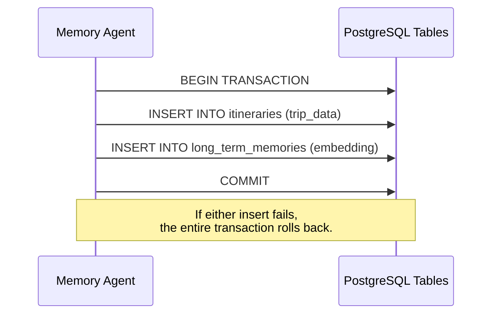

# 22 - Master Architecture (ARCHITECTURE.md)

## 1. Introduction
This is the master architecture document for the AI Travel Assistant. It synthesizes all individual components—from Short-Term Memory in Redis to semantic vectors in PostgreSQL—into a single, cohesive blueprint.

## 2. Complete End-to-End Architecture
Below is the definitive data flow showing exactly how a user's prompt travels through the system, interacts with the memory layers, queries the LLM, and returns a response.

```mermaid
flowchart TD
    %% Actors and Interfaces
    User([User])
    Frontend[Frontend Client\nWeb/Mobile]

    %% Backend Services
    subgraph Backend_Infrastructure [Backend Infrastructure]
        API[Backend API\nFastAPI/Node]
        Agent[Memory Agent\nBackground Worker]
    end

    %% Database Layer
    subgraph Database_Layer [Data & Memory Storage]
        Redis[(Redis\nShort-Term Memory\nUpstash)]
        PG[(PostgreSQL\nRelational Data\nNeon)]
        PGV[(pgvector\nLong-Term Memory\nNeon)]
    end

    %% External AI APIs
    subgraph External_AI [External AI Providers]
        Embed[Embedding Model\nOpenAI text-embedding-3]
        LLM[Large Language Model\nOpenAI GPT-4o]
    end

    %% User Flow
    User -->|Types Prompt| Frontend
    Frontend -->|HTTP POST| API

    %% Memory Retrieval Flow
    API -->|1. Fetch Chat Context| Redis
    API -->|2. Generate Query Vector| Embed
    Embed -->> API: 1536d Vector
    API -->|3. Semantic Search| PGV
    API -->|4. SQL Fact Search| PG

    %% Response Generation Flow
    API -->|5. Build Augmented Prompt| LLM
    LLM -->> API: Generated Response
    API -->|6. Stream Response| Frontend
    Frontend --> User

    %% Background Memory Consolidation
    API -.->|7. Trigger Consolidation| Agent
    Agent -->|Read Session| Redis
    Agent -->|Extract Facts| LLM
    Agent -->|Embed Facts| Embed
    Agent -->|Persist New Memory| PGV
    Agent -->|Clear/Trim| Redis
```

## 3. Database Architecture Summary
Our system splits storage based on access speed and persistence requirements:
1. **Redis:** Handles high-frequency, ephemeral data (Current Chat Session, Rate Limits).
2. **PostgreSQL:** Handles rigid, transactional data (User Profiles, Bookings, Itineraries).
3. **pgvector:** Handles high-dimensional semantic data (User Preferences, Past Experiences).

## 4. The Retrieval-Augmented Generation (RAG) Pipeline
The architecture heavily utilizes RAG to ensure the LLM's responses are personalized.
- **Retrieval:** We execute parallel queries against `pgvector` (using Cosine Distance `<=>`) and PostgreSQL (using standard `SELECT` joins) to gather context.
- **Augmentation:** We prepend this context to the LLM's system instructions.
- **Generation:** The LLM generates a mathematically probable response based strictly on the injected context.
*(Detailed in [14 - Retrieval Pipeline](14_Retrieval_Pipeline.md) and [15 - RAG Pipeline](15_RAG_Pipeline.md)).*

## 5. Deployment Architecture
Our deployment strategy transitions from local Docker containers to fully managed serverless infrastructure to achieve high availability.

```mermaid
flowchart LR
    subgraph Local Development
        Dev(Developer) --> Docker[Docker Compose]
        Docker --> LocalPG[(Local PostgreSQL)]
        Docker --> LocalRedis[(Local Redis)]
    end

    subgraph Production Cloud
        ProdAPI[Production API] --> Neon[(Neon PostgreSQL\nServerless)]
        ProdAPI --> Upstash[(Upstash Redis\nServerless)]
    end

    Local Development -.->|GitHub Actions CI/CD| Production Cloud
```
*(Detailed in [16 - Deployment](16_Deployment.md)).*

## 6. Long-Term Memory (LTM) vs Short-Term Memory (STM) Pipelines

### The STM Pipeline
- A user sends 10 rapid messages.
- The Backend API simply uses `RPUSH` to append these messages to a Redis List.
- The LLM context window reads this list to maintain immediate conversational flow.
- Fast, cheap, and temporary (governed by a Time-To-Live expiration).

### The LTM Pipeline
- The Memory Agent detects the conversation has reached a logical pause.
- It extracts a core fact (e.g., "User prefers aisle seats").
- It resolves conflicts (e.g., deleting an old memory that said "User prefers window seats").
- It generates a vector embedding and executes an `INSERT` into PostgreSQL.
- Slow, expensive (requires an LLM call), but permanent.
*(Detailed in [12 - Memory System](12_Memory_System.md) and [13 - Memory Agent](13_Memory_Agent.md)).*

## 7. Data Integrity and Component Interaction
To visualize how data stays consistent across components, we map the ER diagram conceptually to the Agent's actions.


By utilizing PostgreSQL transactions, we guarantee that semantic memories (vectors) never drift out of sync with relational realities (trips).

## 8. Conclusion
The AI Travel Assistant is a state-of-the-art hybrid application. By carefully orchestrating Redis, PostgreSQL, and `pgvector`, we provide the LLM with a flawless memory system that is both incredibly fast and permanently reliable. 

For explanations on *why* these specific technologies were chosen over alternatives, refer to **24_Technology_Decisions.md**.
